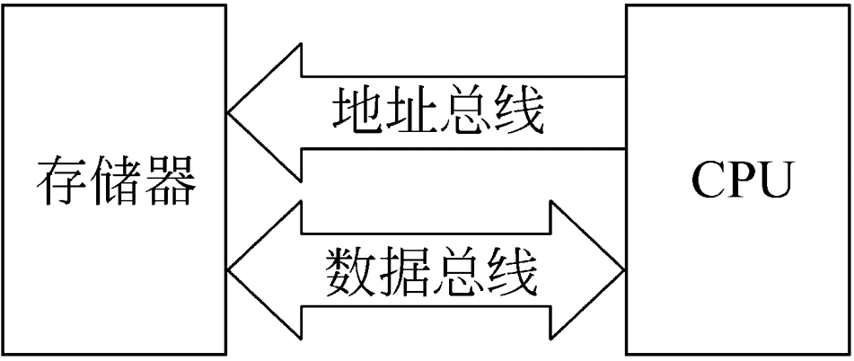
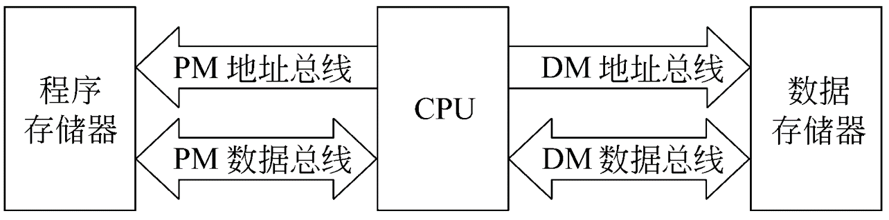
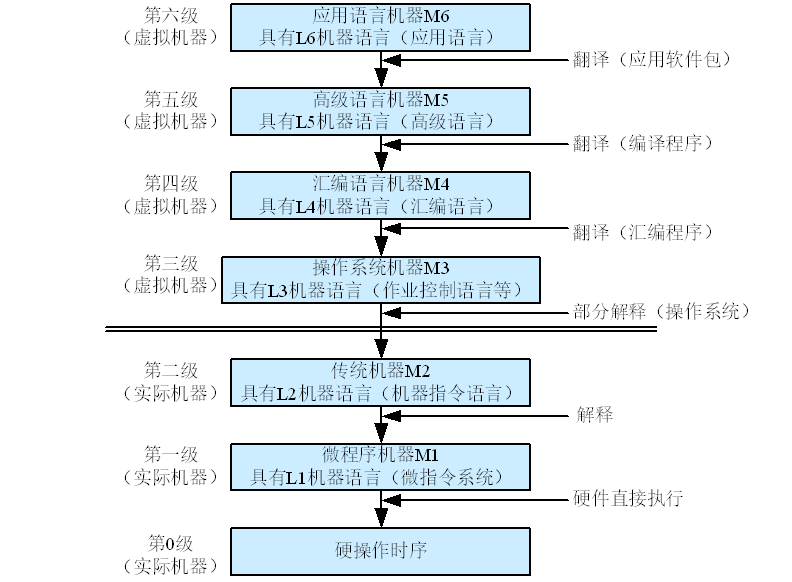

# 第一章-概论
***
## 1.电子计算机与存储程序控制
电子计算机是一种不需要人工直接干预，能够自动、高速、准确的对各种信息进行处理和存储的电子设备。
总体上分为两类：**电子模拟计算机和电子数字计算机**。
通常说的计算机时电子数字计算机，处理的信息是在时间上离散的数字量，运算过程是不连续的
#### 计算机的发展历史
电子管->晶体管->集成电路
第一台电子数字计算机ENIAC（不是存储程序计算机）
计算机的发展趋势：“两极”分化，一极是微型计算机向更微型化、网络化、高性能、多用途发展；另一极是巨型机更巨型化、超高速、并行处理、智能化发展
#### 存储程序概念
>（冯-诺依曼型计算机）
>1. 计算机（指硬件）由五大基本部件组成：运算器、存储器、控制器、输入设备、输出设备
>2. 计算机内部采用二进制来表示指令和数据
>3. 将编好的程序和原始数据事先存入到存储器中，然后再启动计算机工作
***
## 2.计算机的硬件组成
冯-诺依曼计算机在结构上由最初的以运算器为中心发展为现在以存储器为中心
>**中央处理器（CPU）= 运算器+控制器**
**主机 = 中央处理器（CPU）+主存储器**
**外部设备：** 除去主机以外的硬件装置（如输入、输出设备、辅助存储器等）
#### 计算机的主要部件
>+ **输入设备：** 输入设备的任务是把人们编好的程序和原始数据送到计算机中去，并且将它们转换成计算机内部所能识别和接受的信息方式。
>+ **输出设备：** 输出设备的任务是将计算机的处理结果以人或其他设备所能接受的形式送出计算机。
>+ **存储器：** 存储器是用来存放程序和数据的部件，它是一个记忆装置，也是计算机能够实现“存储程序控制”的基础。
在计算机系统中，规模较大的存储器往往分成若干级，称为存储系统。**主存储器**可由CPU直接访问，存取速度快但容量较小，一般用来存放当前正在执行的程序和数据。**辅助存储器**设置在主机外部，它的存储容量大，价格较低，但存取速度较慢，一般用来存放暂时不参与运行的程序和数据，这些程序和数据在需要时可传送到主存，因此它是主存的补充和后援。当CPU速度很高时，为了访问存储器的速度能与CPU的速度相匹配，在主存和CPU间增设了一级**Cache（高速缓冲存储器）**，存取速度比主存更快，但容量更小，用来存放当前最急需处理的程序和数据，以便快速地向CPU提供指令和数据。
>+ **运算器：** 对信息进行处理和运算的部件，又称**算数逻辑运算部件**。运算器的核心是加法器。运算器中还有若干个通用寄存器或累加寄存器，用来暂存操作数，并存放运算结果。寄存器的存取速度比储存器的存取速度快得多。
>+ **控制器：** 是整个计算机的指挥中心，它的主要功能是按照人们预先确定的操作步骤，控制整个计算机的各部件有条不紊地自动工作。控制器从主存中逐条地取出指令进行分析，根据指令的不同来安排操作顺序，向各部件发出相应的操作信号，控制它们执行指令所规定的任务。控制器中包括一些专用的寄存器。
#### 计算机的总线结构
总线是一组能为多个部件服务的公共信息传送线路。它能分时地发送与接收各部件的信息。计算机中采用总线结构，可以大大减少信息传送线的数目，又可以提高计算机扩充主存及外部设备的灵活性。
>1.单总线结构
各大部件都连接在单一的一组总线上，故将这个单总线称为系统总线。CPU与主存、CPU与外设、主存与外设、外设与外设之间可以直接进行信息交换，无须经过CPU的干预。**单总线结构提高了CPU的工作效率，而且外设连接灵活，易于扩充**；但是同一时刻只允许一对设备（或部件）之间传送信息。
所谓单总线并不是指只有一根信号线。系统总线按传送信息的不同可以细分为:**地址总线、数据总线和控制总线**。
地址总线由单方向的多根信号线组成,用于CPU向主存、外设传输地址信息。
数据总线由双方向的多根信号线组成，CPU可以沿这些线从主存或外设读人数据，也可以沿这些线向主存或外设送出数据。
控制总线上传输的是控制信息,包括CPU送出的控制命令和主存(或外设)返回CPU的反馈信号。
总线结构是小、微型计算机的典型结构。这是因为小、微型计算机的设计目标是以较小的硬件代价组成具有较强功能的系统，而总线结构正好能满足这一要求。

>2.总线电路
（1）三态门，具有3种逻辑状态的门电路，分别是逻辑“0”、逻辑“1”和浮空状态。利用三态门可以控制传输线上信号的传送方向，同时还允许多个输出端并联使用，只要这些门的控制端不同时有效就可以了
（2）单项和双向总线
单向总线是指总线上的信息只能向一个方向传送，双向总线是指总线上的信息可以向两个方向传送。地址总线是单向总线，数据总线是双向总线。
#### 大、中型计算机的典型结构
在系统连接上分为四级：主机、通道、设备控制器、外部设备。
通道是承担I/O操作管理的主要部件，能使CPU的数据处理和与外部设备交换信息这两项操作同时进行。每个通道可以接一台或几台设备控制器，每个设备控制器又可接一或几台外部设备，这样整个系统就可以连接很多的外部设备。
**冯·诺依曼结构**即指令和数据是不加区别地混合存储在同一个存储器中的，共享数据总线。指令地址和数据地址指向同一个存储器的不同物理位置，指令和数据的宽度相同。由于指令和数据存放在同一存储器中，因此冯·诺依曼结构中不能同时取指令和取操作数。

**哈佛结构**的指令和数据是完全分开的，存储器分为两部分，一个是程序存储器，用来存放指令，另一个是数据存储器，用来存放数据。这意味着在一个机器周期内可以同时准备好指令和操作数，本条指令执行时可以预先读取下一条指令，所以哈佛结构的中央处理器通常具有较高的执行效率。

***
## 3.计算机系统
#### 硬件系统和软件系统
硬件是计算机系统的物质基础，正是在硬件高度发展的基础上，才有软件赖以生存的空间和活动场所，没有硬件对软件的支持，软件的功能就无从谈起。同样，软件是计算机系统的灵魂，没有软件的硬件“裸机”将不能提供给用户使用，犹如一堆废铁。因此，硬件和软件是相辅相成的，不可分割的整体。
一些由硬件实现的功能可以由软件模拟来实现，称为**硬件软化**，可以增强系统的功能和适应性；反之，称为**软件硬化**，可以显著降低软件在时间上的开销。***它们在逻辑上是等价的。***
**固件：** 指那些存储在能永久保存信息的器件（如ROM）中的程序，是具有软件功能的硬件。固件的性能指标介于硬件与软件之间,吸收了软、硬件各自的优点,其执行速度快于软件,灵活性优于硬件,是软、硬件结合的产物,**计算机功能的固件化将成为计算机发展中的一个趋势。**
#### 系列机与软件兼容
**系列机：** 指一个厂家生产的,具有相同的系统结构,但具有不同组成和实现的一系列不同型号的机器。
>这里的相同是指在指令系统、数据格式、字符编码、中断系统、控制方式和输入输出操作方式等多个方面保持统一,从而保证了软件的兼容。系列机的软件兼容分为向上兼容、向下兼容、向前兼容和向后兼容4种。**向上(下)兼容**指的是按某档次机器编制的程序,不加修改就能运行在比它更高(低)档的机器上;**向前(后)兼容**是指按某个时期投人市场的某种型号机器编制的程序,不加修改就能运行在它之前(后)投人市场的机器上。

对系列机的软件向下和向前兼容可以不作要求，**但必须保证向后兼容，力争做到向上兼容。**

#### 计算机系统的多层次结构
第0级为硬件组成的实体
**第一级是微程序级**。这级的机器语言是微指令集,程序员用微指令编写的微程序一般是直接由硬件执行的。
**第二级是传统机器级**。这级的机器语言是该机的指令集,程序员用机器指令编写的程序可以由微程序进行解释。
**第三级是操作系统级**。从操作系统的基本功能来看,一方面它要直接管理传统机器中的软硬件资源,另一方面它又是传统机器的延伸。
**第四级是汇编语言级**。这级的机器语言是汇编语言,完成汇编语言翻译的程序叫做汇编程序。
**第五级是高级语言级**。这级的机器语言就是各种高级语言,通常用编译程序来完成高级语言翻译的工作。
**第六级是应用语言级**。这级是为了使计算机满足某种用途而专门设计的，因此这级语言就是各种面向问题的应用语言。

实际机器是指由硬件或固件实现的机器（第0～二级）。虚拟机器是指以软件或以软件为主实现的机器（第三～六级）。
虚拟机器只对该级的观察者存在，即在某一级观察者看来，他只需要通过该级的语言来了解和使用计算机，至于下级是如何工作和实现就不必关心了。如高级语言级及应用语言级的用户，可以不了解机器的具体组成，不必熟悉指令系统，直接用所指定的语言描述所要解决的问题。
***
## 4.计算机的工作过程和主要性能指标
#### 计算机的工作过程
将编制好的程序放在主存中，由控制器控制逐条取出指令执行。程序是一个特定的指令序列，它告诉计算机要做哪些事，按什么步骤去做。指令是一组二进制信息的代码，用来表示计算机所能完成的基本操作。
#### 计算机的主要性能指标
>1. **机器字长：** 机器字长是指参与运算的数的基本位数，它是由加法器、寄存器的位数决定的。所以机器字长一般等于内部寄存器的大小。**字长标志着精度，正比关系** 在计算机中为了更灵活地表达和处理信息，又以字节为基本单位，用大写字母B表示。一个字节等于8位二进制位（bit）。
>2. **数据通路宽度：** 数据总线一次所能并行传送信息的位数，称为数据通路宽度。它影响到信息的传送能力，从而影响计算机的有效处理速度。这里所说的数据通路宽度是指外部数据总线的宽度，它与CPU内部的数据总线宽度（内部寄存器的大小）有可能不同。 
>3. **主存容量：** 主存储器所能存储的全部信息量称为主存容量。通常以字节数来表示存储容量，这样的计算机称为**字节编址的计算机**，也有一些计算机是以字为单位编址的，它们用字数乘以字长来表示存储容量。每1024个字节称为1K字节,每1024K字节称为1M字节,每1024M字节称为1G字节...计算机的主存容量越大,存放的信息就越多,处理问题的能力就越强。
>4. **运算速度：** 与许多因素有关，如机器的主频、执行什么样的操作以及主存本身的速度等
⑴**吞吐量和响应时间**
吞吐量是指系统在单位时间内处理请求的数量。响应时间是指系统对请求作出响应的时间，包括CPU时间与等待时间的总和。
⑵**主频和CPU时钟周期**
CPU的主频又称为时钟频率，表示在CPU内数字脉冲信号振荡的速度。主频的倒数就是CPU时钟周期，这是CPU中最小的时间元素。每个动作至少需要一个时钟周期。
⑶**CPI**
CPI是指每条指令执行所用的时钟周期数。
⑷**CPU执行时间**
$$ CPU执行时间=\frac{CPU时钟周期数}{时钟频率} $$  
⑸**MIPS和MFLOPS**
MIPS表示每秒执行多少百万条指令。
$$ MIPS=\frac{指令条数}{执行时间*10^6} $$
这里说的指令一般是指加、减运算这类的短指令。
MFLOPS表示每秒执行多少百万次浮点运算。
$$ MFLOPS=\frac{浮点操作次数}{执行时间*10^6} $$
适用于衡量向量机的性能

