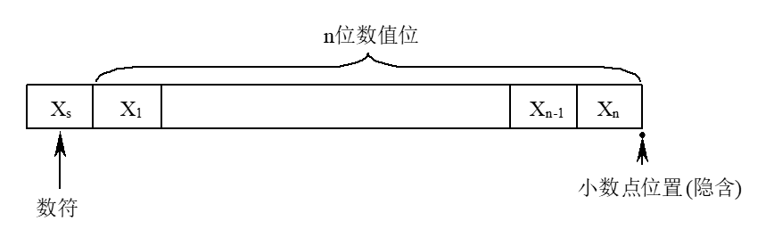
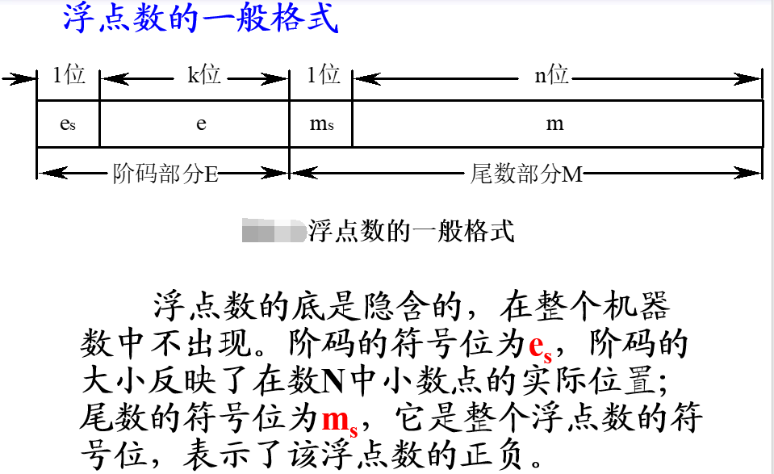
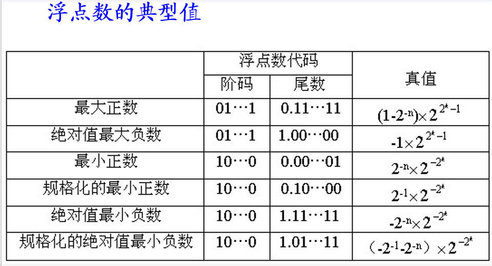
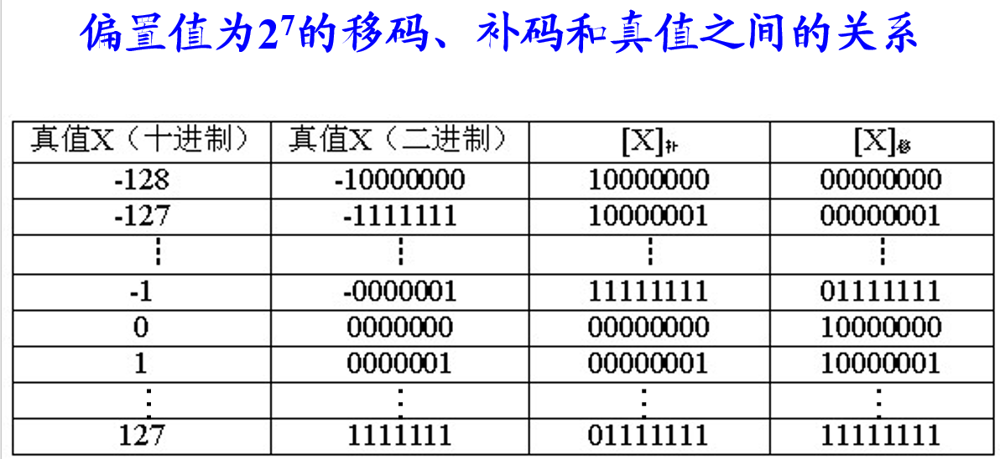
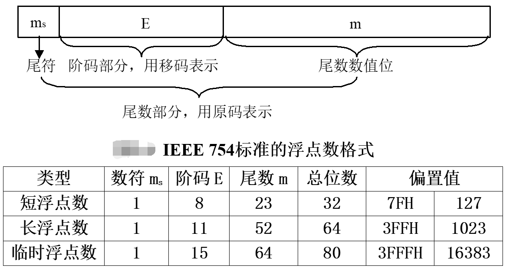
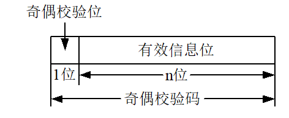
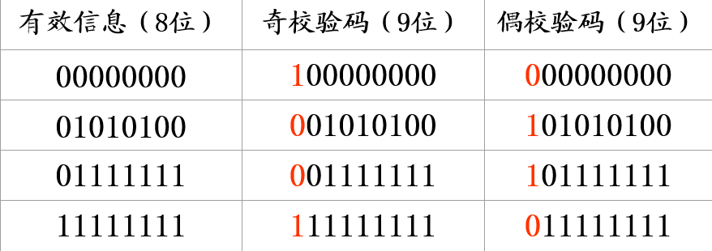
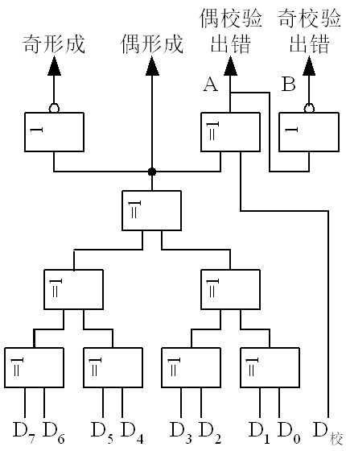
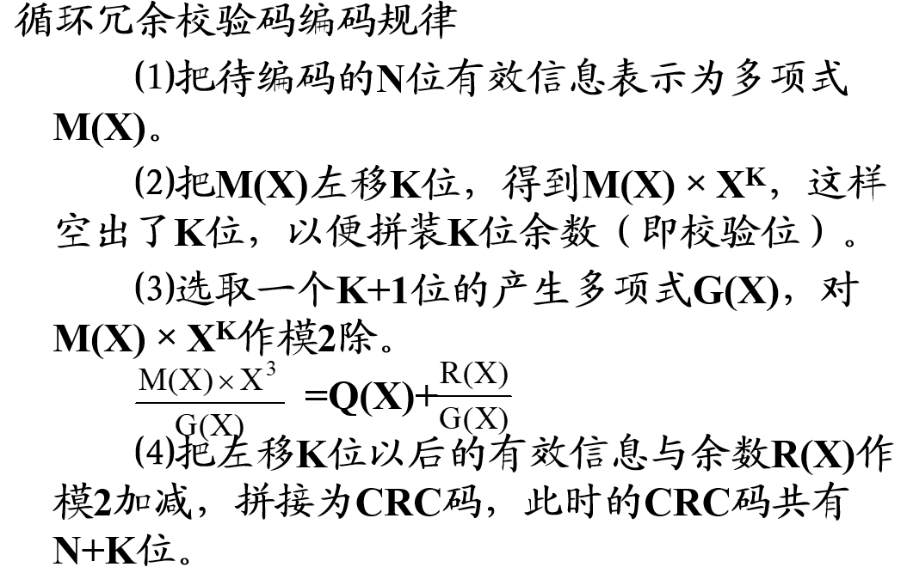

# 第二章-数据的机器层次表示
***
## 1.数值数据的表示
在计算机中，采用数字化方式来表示数据，数据有无符号数和带符号数之分，其中带符号数根据其编码的不同又有原码、补码和反码3种形式。
#### 计算机中的数值数据
进制表示有下标，前缀，后缀
二进制数：后缀B
八进制数：后缀Q，前缀0
十进制数：后缀D或省略后缀
十六进制数：后缀H，前缀0x
#### 无符号数和带符号数
**无符号数**就是整个机器字长的全部二进制位均表示数值位（没有符号位），相当于数的绝对值。
机器字长为n+1位的无符号数的表示范围是**0~（$2^{n+1}-1$），此时二进制的最高位也是数值位，其权重等于$2^n$
**带符号数**，即正、负数。用这种形式表示的数值在计算机技术中称为"真值"。
在计算机中需要把数的符号数码化。通常，约定 **二进制数的最高位为符号位**，“0”表示正号，“1”表示负号。这种在计算机中使用的表示数的形式称为 **机器数**。
>**原码表示法：** 
设 **二进制纯小数**的原码形式为$X_s.X_1X_2…X_n$,字长n+1位， **$X_s$** 表示符号位
如：$X$=-0.0110，则$[X]_原=1.0110$
设 **二进制纯整数**的原码形式为$X_sX_1X_2…X_n$， **$X_s$** 表示符号位
如：$X$=-1101，则$[X]_原=11101$
***真值0有两种不同的表示*** :[00000]或[10000]

模是指一个计量器的容量，可用M表示。例如：一个4位的二进制计数器，当计数器从0计到15之后，再加1，计数值又变为0。这个计数器的容量M=$2^4$=16，即模为16。
纯小数的模为2，一个字长为n+1位的纯整数的模为$2^{n+1}$

同余是指两整数A、B除以同一正整数M，所得余数相同，则称A、B对M同余，即A、B在以M为模时是相等的，可写作: A=B (mod M)     
>**补码表示法：** 符号位表示方法与原码相同，数值部分的表示与数的**正负**有关，正数时，数值部分与真值形式相同；负数时，**将真值的数值部分按位取反，且在最低位加1**
若真值为纯小数，它的补码形式为$X_s.X_1X_2…X_n$, **$X_s$** 表示符号位
如：$X$=-0.0110，则$[X]_补=1.1010$
若真值为纯整数，它的补码形式为$X_sX_1X_2…X_n$,**$X_s$** 表示符号位
如：$X$=-1101，则$[X]_补=10011$
***补码表示中，真值0的表示形式唯一*** :[00000]

由$[X]_原$转换为$[X]_补$的另一种有效方法：自低位到高位，尾数第一个1以及它右边的0保持不变，其他的（左边）全部取反（符号位不变）

>**反码表法：** 对于正数，数值部分与真值形式相同；对于负数，将真值的数值部分按位取反。
若真值为纯小数，它的反码形式为$X_s.X_1X_2…X_n$, **$X_s$** 表示符号位
如：$X$=-0.0110，则$[X]_反=1.1001$
若真值为纯整数，它的补码形式为$X_sX_1X_2…X_n$,**$X_s$** 表示符号位
如：$X$=-1101，则$[X]_补=10010$
***真值0有两种不同的表示*** :[00000]或[11111]

**比较：**
+ 对于正数它们都等于真值本身，而对于负数各有不同的表示。
+ 最高位都表示符号位，补码和反码的符号位可作为数值位的一部分看待，和数值位一起参加运算；但原码的符号位不允许和数值位同等看待，必须分开进行处理。
+ 对于真值0，原码和反码各有两种不同的表示形式，而补码只有唯一的一种表示形式。
+ 原码、反码表示的正、负数范围相对零来说是对称的；但补码负数表示范围较正数表示范围宽，能多表示一个最负的数（绝对值最大的负数），其值等于-2n（纯整数）或-1（纯小数）

如果已经知道机器的字长，则机器数的位数应补够相应的位数
***
## 2.机器数的定点表示与浮点表示
计算机在进行算术运算时，需要指出小数点的位置。根据小数点的位置是否固定，在计算机中有两种数据格式：定点表示和浮点表示。
#### 定点表示法
在定点表示法中约定：所有数据的小数点位置固定不变。通常把小数点固定在有效数位的最前面或末尾。
1.定点小数
即纯小数，小数点的位置固定在**最高有效数位之前，符号位之后**，记作$X_s.X_1X_2…X_n$，这个数是一个纯小数。定点小数的小数点位置是隐含约定的，小数点并不需要真正地占据一个二进制位。

当$X_s=1$，表示$X$为负数，此时情况要稍微复杂一些，这是因为在计算机中带符号数可用补码表示，也可用原码表示。原码和补码的表示范围有一些差别。
若机器数为原码表示，当$X_s～X_n$均等于1时，$X$为绝对值最大的负数。
$X$绝对值最大负数=$-(1-2^{-n})$
若机器数为补码表示，当$X_s$=1，$X_1～X_n$均等于0时，X为绝对值最大的负数。
$X$绝对值最大负数=-1

2.定点整数
即纯整数，小数点位置隐含固定在最低位有效位之后，记作$X_sX_1X_2…X_n$

#### 浮点表示法
小数点的位置根据需要而浮动，这就是浮点数。例如：
$$N=M*r^E$$
式中：r为浮点数阶码的底，与尾数的基数相同，通常r=2。E和M都是带符号的定点数，E叫做阶码，M叫做尾数。在大多数计算机中，尾数为纯小数，常用原码或补码表示；阶码为纯整数，常用移码或补码表示

浮点数的表示范围主要由**阶码的位数**来决定,有效数字的精度主要由**尾数的位数**来决定
1.浮点数的表示范围
当$e_s=0，m_s=0$，阶码和尾数的数值位各位全为1（即阶码和尾数都为最大正数）时，该浮点数为最大正数：
$$X_{最大正数}=(1-2^{-n})*2^{2^k-1}$$
当$e_s=1，m_s=0$，尾数的最低位$m_n$=1，其余各位为0（即阶码为绝对值最大的负数，尾数为最小正数）时，该浮点数为最小正数：
$$X_{最小正数}=2^{-n}*2^{-2^k}$$
当$e_s=0$,阶码的数值位全为1；$m_s=1$,尾数的数值位全为0（即阶码为最大正数，尾数为绝对值最大的负数）时，该浮点数为绝对值最大的负数：
$$X_{绝对值最大的负数}=-1*2^{2^k-1}$$

2.规格化浮点数
为了提高运算的精度，需要充分地利用尾数的有效数位，通常采取浮点数规格化形式，即**规定尾数的最高数位必须是一个有效值**。
规格化浮点数的尾数M的绝对值应在下列范围内：
$$\frac{1}{r}<|M|<1$$
r=2时，$\frac{1}{2}<|M|<1$
在尾数用原码表示时，规格化浮点数的尾数的最高数位总等于1。在尾数用补码表示时，规格化浮点数应满足**尾数最高数位与符号位不同**（$m_s⊕m_1 =1$），即当$\frac{1}{2}≤M<1$时，应有0.1xx…x形式，当$-1≤M＜ -\frac{1}{2}$时，应有1.0xx…x形式。
需要注意的是当$M=-\frac{1}{2}$，对于原码来说，是规格化数，而对于补码来说，不是规格化数。当$M=-1$，对于原码来说，不是规格化数，而对于补码来说，是规格化数。

当$e_s=1，m_s=0$，尾数的最高位$m_1=1$，其余各位为0时，该浮点数为规格化的最小正数：
$X_{规格化的最小正数}=2^{-1}*2^{-2^k}$
***规格化的最小正数大于非规格化的最小正数。***

只要浮点数的尾数为0，不论阶码为何值，一般都当做机器0处理。为了保证浮点数0表示形式的惟一性，此时应把阶码置成最小值(绝对值最大的负数)。
规格化浮点数时，尾数右移一位，阶码 +1
#### 浮点数阶码的移码表示法
移码就是在真值X上加一个常数（偏置值），相当于X在数轴上向正方向平移了一段距离。
$$[X]_移=偏置值+X$$
对于字长8位的定点整数，偏置值为$2^7$
例：X=1011101
$[X]_移=2^7+X=10000000+1011101=11011101$
$[X]_补=01011101$
X=-1011101
$[X]_移=2^7+X=10000000-1011101=00100011$
$[X]_补=10100011$

偏置值为$2^n$的移码的特点：
⑴在移码中，最高位为“0”表示负数，最高位为“1”表示正数。(与之前相反)
⑵移码为全0时，它所对应的真值最小，为全1时，它所对应的真值最大。
⑶真值0在移码中的表示形式是唯一的，即[+0]移=[-0]移=**100…0**。
⑷移码把真值映射到一个正数域，所以可将移码视为无符号数，直接按无符号数规则比较大小。
⑸**同一数值的移码和补码除最高位相反外，其他各位相同**。

浮点数的阶码采用移码的原因：
+ 便于比较浮点数的大小。阶码大的，其对应的真值就大，阶码小的，对应的真值就小。
+ 简化机器中的判零电路。当阶码全为0，尾数也全为0时，表示机器零。

#### 浮点数尾数的基数
浮点数尾数基数的选择对浮点数的特性起着主要作用，它**既影响浮点运算的精度，也影响数值的表示范围**。
改变尾数基数r，会使浮点数的特性有下列影响： 
① 可表示数的范围。(r越大范围越大)
② 可表示数的个数。（r越大个数越大）
③ 数在数轴上的分布。（r越大数的分布越稀疏）
④ 可表示数的精度。(r越大可表示数的精度单调下降)
⑤ 运算中的精度损失。（r越大，损失机会越小）
⑥ 运算速度。（r越大速度可以提高）

#### 定点机和浮点机
**定点机**：以定点运算为主，浮点运算是通过软件来实现的。如低档微、小型计算机和某些专用机
**浮点机**：具有浮点运算指令和基本的浮点运算器。如大、中型计算机
**定点机+浮点运算部位**：浮点运算部位是专门用于对计算机内的浮点数进行运算的部件，系统配置了浮点运算部件，将使浮点运算速度大大提高

**定点、浮点表示法的区别：**
**⑴数值的表示范围**
假设定点数和浮点数的字长相同，浮点表示法所能表示的数值范围将远远大于定点数。
**⑵精度**
对于字长相同的定点数和浮点数来说，浮点数虽然扩大了数的表示范围，但这正是以降低精度为代价的，也就是数轴上各点的排列更稀疏了。
**⑶数的运算**
浮点运算要比定点运算复杂得多。
**⑷溢出处理**
在定点运算时，当运算结果超出数的表示范围，就发生溢出。而在浮点运算时，运算结果超出尾数的表示范围却并不一定溢出，只有当阶码超出所能表示的范围时，才发生溢出。
#### 实用浮点数举例

***
## 3.非数值数据的表示
非数值数据又称字符数据，通常指字符、字符串、图形符号和汉字等各种数据。不用来表示数值的大小。
#### 字符和字符串的表示
1.ASCII字符编码
常见的ASCII码用7位二进制表示一个字符，它包括10个十进制数字（0～9）、52个英文大写和小写字母（A～Z，a～z）、34个专用符号和32个控制符号，共计128个字符。
在计算机中，通常用一个字节来存放一个字符。对于ASCII码来说，一个字节右边的7位表示不同的字符代码，而最左边一位可以作奇偶校验位，用来检查错误，也可以用
于西文字符和汉字的区分标识。
在ASCII码表中，数字和英文字母都是按顺序排列的，只要知道其中一个的二进制代码，不要查表就可以推导出其他数字或字母的二进制代码

2.字符串的存放
字符串是指一串连续的字符。例如，字符串IF X>0 THEN READ (C)。
**向量存放法**在存储器中占用一片连续的空间，每个字节存放一个字符代码，字符串的所有元素（字符）在物理上是邻接的。在字长为32位的存储器，每一个主存单元可存放4个字符，整个字符串需5个主存单元。在每个字节中实际存放的是相应字符的ASCII码。字符串的向量存放法是最简单、最节省存储空间的方法。但是，当字符串需要进行删除和插入操作时.在删除或插入字符后面的子字符串需要全部重新分配存储空间，将花费较多的时间。

**串表法**
字符串中的每个字符代码后有一个链接字，用以指出下一个字符的存储单元地址。串表法不要求串中的各个字符在物理上相邻，原则上讲，串中各字符可以安排在存储器的任意位置上。在对字符串进行删除和插入操作时，只需修改相应字符代码后面的链接字即可。缺点就是，由于链接字占据了存储单元的大部分空间，使得主存的有效利用率下降。
#### 汉字的表示
1.汉字国标码
亦可称为汉字交换码，主要用于汉字信息处理系统之间或者通信系统之间交换信息使用，简称GB码。该标准共收集常用汉字6763个，另外还有各种图形符号682个，共计7445个。GB码规定每个汉字、图形符号都用两个字节表示，每个字节只使用低七位编码，因此最多能表示出128×128=16384个汉字。
2.汉字区位码
区位码将汉字编码中的6763个汉字分为94个区，每个区中包含94个汉字（位），区和位组成一个二维数组，每个汉字在数组中对应一个唯一的区位码。汉字的区位码定长4位，前2位表示区号，后2位表示位号，**区号和位号用十进制数表示**，区号从01到94，位号也从01到94。例如，“中”字在54区的48位上，其区位码为“54-48”，“国”字在25区的90位上，其区位码为“25-90”。 
需要注意的是：汉字区位码并不等于汉字国标码，它们两者之间的关系可用以下公式表示：
**国标码＝区位码（十六进制）＋2020H**
例：已知汉字“春”的区位码为“20-26”，计算它的国标码。
|区位码|第1字节|第2字节||
|---|:----|---:|:----:| 
||20|26|十进制|
|| 14H | 1AH |十六进制|
|| +20H | +20H ||
|国标码|34H|3AH|

3.汉字机内码
汉字在计算机内部其内码是唯一的。因为汉字处理系统要保证中西文的兼容，当系统中同时存在ASCII码和汉字国标码时，将会产生二义性。例如：有两个字节的内容为30H和21H，它既可表示汉字“啊”的国标码，又可表示西文“0”和“!”的ASCII码。为此，汉字机内码应对国标码加以适当处理和变换。
GB码的机内码为二字节长的代码，它是在相应GB码的每个字节最高位上加“1”，即
**汉字机内码＝汉字国标码＋8080H**
例，“啊”字的国标码是3021H，其汉字机内码则是B0A1H。 
4.汉字字形码
汉字字形码是指确定一个汉字字形点阵的代码，又叫汉字字模码或汉字输出码。在一个汉字点阵中，凡笔画所到之处，记为“1”，否则记为“0”。根据对汉字质量的不同要求，可有16×16、24×24、32×32或48×48的点阵结构。显然点阵越大，输出汉字的质量越高，每个汉字所占用的字节数也越高。

#### 统一代码
信息处理应用对字符集提出了多文种、大字量、多用途的要求，解决问题的最佳方案是设计一种全新的编码方法，这就是统一代码（Unicode）。
Unicode的基本方法是用一个16位来表示每个符号，这意味着允许表示65536个不同的字符或符号。这种符号集被称为基本多语言平面（BMP），基本多语言平面的字符编码为U+hhhh，其中每个h代表一个十六进制数字。
***
## 4.十进制和数串的表示
用四位二进制数来表示一位十进制数，称为**二进制编码的十进制数，简称BCD码**。
四位二进制数可以组合出16种代码，能表示16种不同的状态，我们只需要使用其中的10种状态，就可以表示十进制数的0～9十个数码，而其他的六种状态为冗余状态。由于可以取任意的10种代码来表示十个数码，所以就可能产生多种BCD编码。BCD编码既具有二进制数的形式，又保持了十进制数的特点。
>8421码
又称为NBCD码，其主要特点是：
⑴ 它是一种有权码，四位二进制代码的位权从高到低分别为8、4、2、1。
⑵ 简单直观。每个代码与它所代表的十进制数之间符合二进制数和十进制数相互转换的规则。
⑶ 不允许出现1010～1111。这6个代码在8421码中是非法码。

>2421码
主要特点是：
⑴ 它也是一种有权码，四位二进制代码的位权从高到低分别为2、4、2、1。
⑵ 它又是一种对9的自补码。即某数的2421码，只要自身按位取反，就能得到该数对9之补的2421码。例如：3的2421码是0011。3对9之补是6，而6的2421码是1100。
⑶ 不允许出现0101～1010。这6个代码在2421码中是非法码。

>余3码
主要特点是：
⑴ 这是一种无权码，但也可看作是一种特殊的有权码，即在8421码的基础上加+3（+0011）形成的，故称余3码。在这种编码中各位的“1”不表示一个固定的十进制数值，因而不直观。
⑵ 它也是一种对9的自补码。
⑶ 不允许出现0000～0010、1101～1111。这6个代码在余3码中是非法码。

>格雷（Gray）码的主要特点是：
⑴它也是一种无权码。
⑵从一种代码变到相邻的下一种代码时，只有一个二进制位的状态在发生变化。
⑶具有循环特性，即首尾两个数的Gray码也只有一个二进制位不同，因此Gray码又称为循环码。
⑷十进制Gray码也有6个代码为非法码，视具体方案而定。

#### 十进制数串
十进制数在计算机中是以数串的形式存储和处理的。十进制数串的长度是可变的，不受定点数和浮点数统一格式的约束。有两种表示形式
> **1.非压缩的十进制数串**
非压缩的十进制数串中一个字节存放一个十进制数或符号的ASCII-7码。
非压缩的十进制数串又分成前分隔式数字串和后嵌入式数字串两种格式。在前分隔式数字串中，符号位占用单独一个字节，放在数值位之前，正号对应的ASCII码为2BH，负号对应的ASCII码为2DH。在后嵌入式数字串中，符号位不单独占用一个字节，而是嵌入到最低一位数字里边去。若数串为正，则最低一位数字0～9的ASCII码不变（30H～39H）；若数串为负，把负号变为40H，并将其与最低数值位相加，此时数字0～9的ASCII码变为70H～79H。  
> **2.压缩的十进制数串**
压缩的十进制数串，一个字节可存放两位BCD码表示的十进制数，既节省了存储空间，又便于直接进行十进制算术运算。 
在主存中，一个压缩的十进制数串占用连续的多个字节，每位数字仅占半个字节，其值常用8421码表示。符号位也占半个字节，并存放在最低数值位之后，通常用CH表示正号，DH表示负号。在这种表示中，规定数字的个数加符号位之和必须为偶数；当和为奇数时，应在最高数值位之前补0H（即第一个字节的高半字节为“0000”）。 
***
## 5.数据校验码
数据校验码是指那些能够发现错误或能够自动纠正错误的数据编码，又称之为“检错纠错编码”。任何一种编码都由许多码字构成，任意两个码字之间最少变化的二进制位数，被称为数据校验码的码距。例如，用四位二进制表示16种状态，则有16个不同的码字，此时码距为1，即两个码字之间最少仅有一个二进制位不同（如0000与0001之间）。这种编码没有检错能力，因为当某一个合法码字中有一位或几位出错，就变成为另一个合法码字了。
#### 奇偶校验码
是一种最简单的数据校验码，它的码距等于2，可以检测出一位错误（或奇数位错误），但不能确定出错的位置，也不能检测出偶数位错误。
奇偶校验实现方法是：由若干位有效信息（如一个字节），再加上一个二进制位（校验位）组成校验码。

奇偶校验码规律
校验位的取值（0或1）将使整个校验码中“1”的个数为奇数或偶数，所以有两种可供选择的校验规律：
>奇校验──整个校验码（有效信息位和校验位）中“1”的个数为奇数。
偶校验──整个校验码中“1”的个数为偶数。 

#### 简单奇偶校验 
仅实现横向的奇偶校验，下表给出几个字节的奇偶校验码的编码结果。最高一位为校验位，其余8位为信息位。在实际应用中，多采用奇校验，因为奇校验中不存在全“0”代码，在某些场合下更便于判别。

⑴校验位形成
当要把一个字节的代码$D_7～D_0$写入主存时，就同时将它们送往奇偶校验逻辑电路，该电路产生的“奇形成”信号就是校验位。它将与8位代码一起作为奇校验码写入主存。
>若$D_7～D_0$中有偶数个“1”，则“奇形成”=1
若$D_7～D_0$中有奇数个“1”，则“奇形成”=0。

⑵校验检测
读出时，将读出的9位代码（8位信息位和1位校验位）同时送入奇偶校验电路检测。若读出代码无错，则“奇校验出错”=0；若读出代码中的某一位上出现错误，则“奇校验出错”=1，从而指示这个9位代码中一定有某一位出现了错误，但具体的错误位置是不能确定的。
#### 交叉奇偶校验
横向、纵向同时校验
#### 海明校验码
海明码实际上是一种多重奇偶校验，其实现原理是：在有效信息位中加入几个校验位形成海明码，使码距比较均匀地拉大，并把海明码的每一个二进制位分配到几个奇偶校验组中。当某一位出错后，就会引起有关的几个校验位的值发生变化，这不但可以发现错误，还能指出错误的位置，为自动纠错提供了依据。 
⑴编码
一个字节由8位二进制位组成，故海明码的总位数为13位，可表示为：
$H_{13} H_{12}…H_2 H_1$ 
五个校验位$P_5～P_1$对应的海明码位号应分别为：$H_{13}、H_8、H_4、H_2、H_1$，除$P_5$外，其余四位都满足$P_i$的位号等于$2^{i-1}$的关系，而$P_5$只能放在$H_{13}$上，因为它已经是海明码的最高位了。
$P_5  D_8  D_7  D_6  D_5  P_4  D_4  D_3  D_2  P_3  D_1  P_2  P_1$ 

⑵校验
将接收到的海明码进行偶校验，校验得到的结果值$S_5～S_1$（指误字）能反映13位海明码的出错情况：
①当$S_5～S_1$为00000时，表明无错。
②当$S_5～S_1$中仅有一位不为0，表明是某一校验位出错或三位海明码（包括信息位和校验位）同时出错。由于后一种出错的可能性很小，故认为是前一种错，出错位是该$S_i$对应的$P_i$位。
#### 循环冗余校验码
在计算机网络、同步通信以及磁表面存储器中广泛使用循环冗余校验码，简称CRC码。
循环冗余校验码是通过除法运算来建立有效信息位和校验位之间的约定关系的。假设，待编码的有效信息以多项式M(X)表示，将它左移若干位后，用另一个约定的多项式G(X)去除，所产生的余数R(X)就是检验位。有效信息和检验位相拼接就构成了CRC码。当整个CRC码被接收后，仍用约定的多项式G(X)去除，若余数为0表明该代码是正确的；若余数不为0表明某一位出错，再进一步由余数值确定出错的位置，以便进行纠正。
（1）编码：
循环冗余校验码是由两部分组成的，左边为信息位，右边为校验位。若信息位为N位，校验位为K位，则该校验码被称为（N+K,N）码。

（2）校验
把接收到的CRC码用约定的生成多项式G(X)去除，如果正确，则余数为0；如果某一位出错，则余数不为0。不同的位数出错其余数不同，余数和出错位序号之间有唯一的对应关系。
（3）生成多项式的选择
生成多项式被用来生成CRC码，并不是任何一个K+1位多项式都可以作生成多项式用的，它应满足下列要求：
⑴任何一位发生错误都应使余数不为0。
⑵不同位发生错误应当使余数不同。
⑶对余数作模2除法，应使余数循环。
在计算机和通信系统中广泛使用下述两个生成多项式，它们是：
$$G(X)=X^{16}+X^{15}+X^2+1$$
$$G(X)=X^{16}+X^{12}+X^6+1$$
