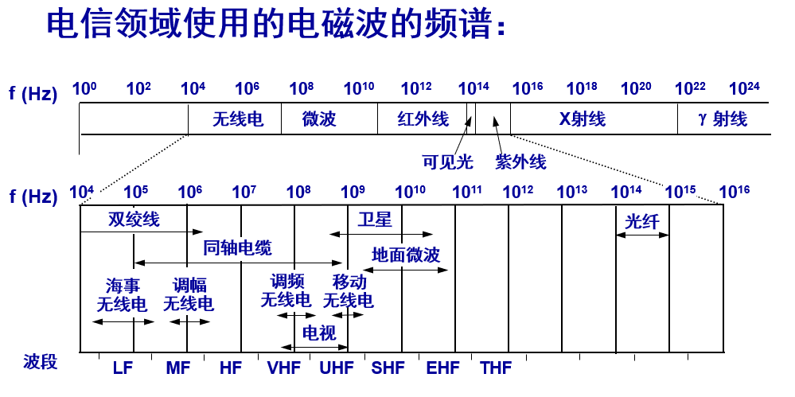
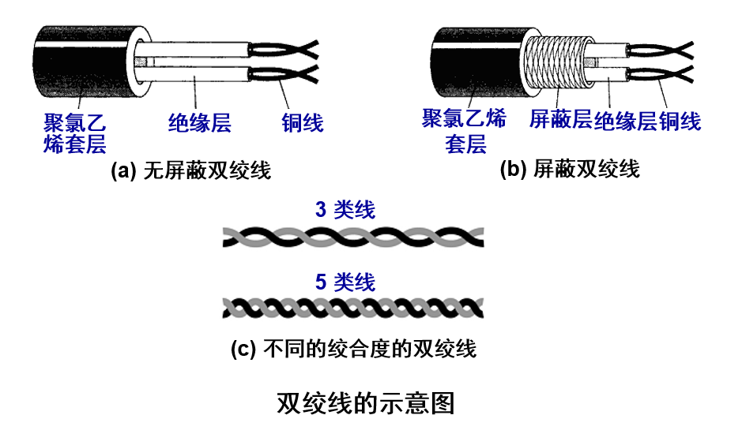
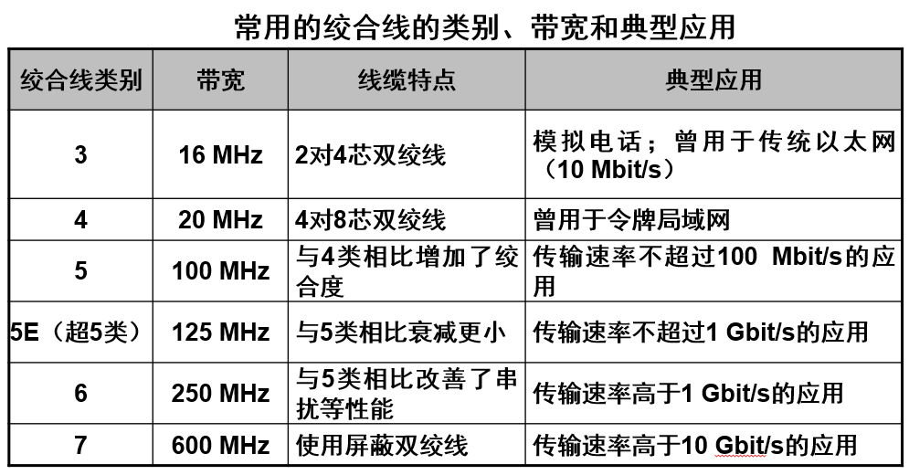
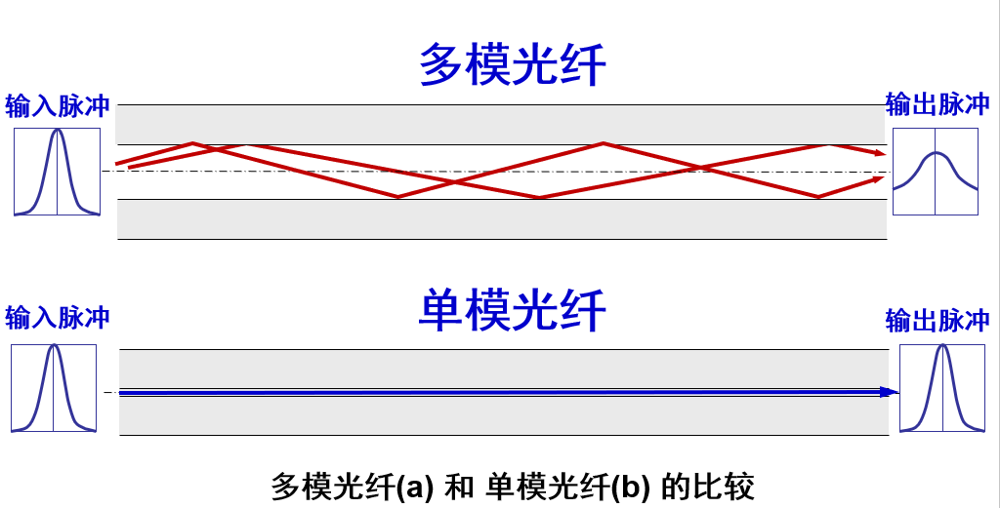
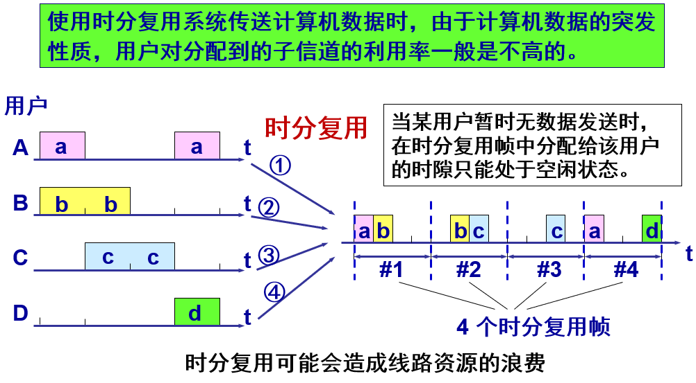
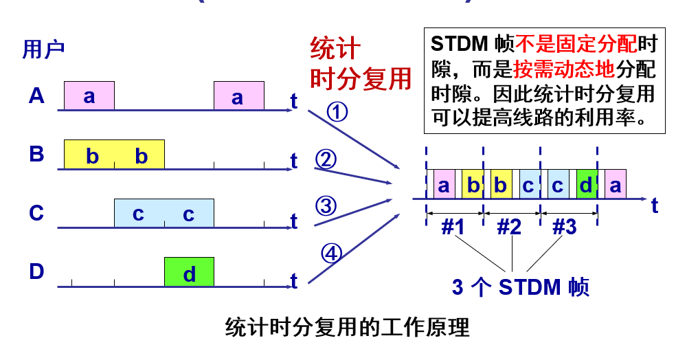
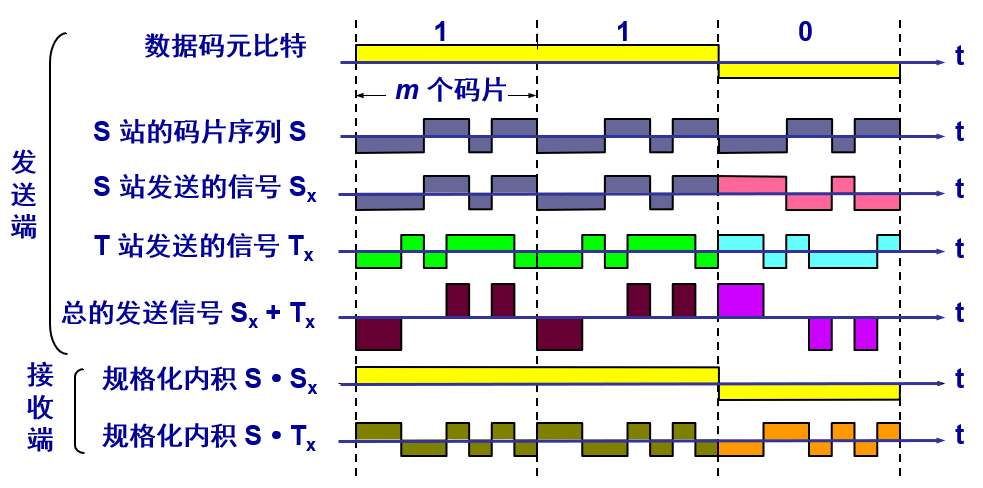
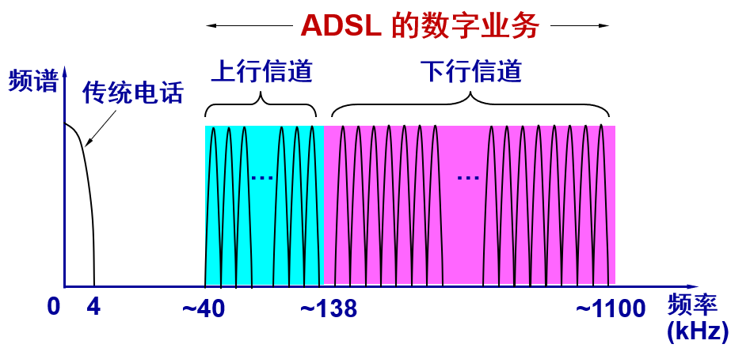
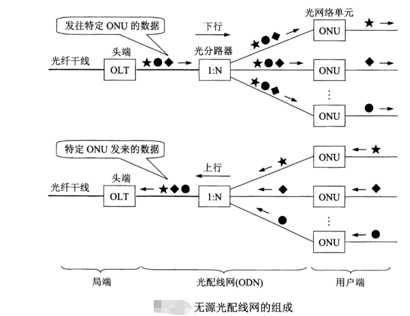

# 第二章-物理层
***
## 1.基本概念
首先强调的是物理层考虑的是怎样才能在连接各种计算机的传输媒体上传输数据比特流，而不是指具体的传输媒体。
物理层的作用是尽可能地屏蔽掉传输媒体和通信手段的差异，使物理层上面的数据链路层感受不到差异，这样可使数据链路层只需要考虑如何完成本层的协议和服务，而不必考虑网络具体的传输媒体和通信手段是什么。用于物理层的协议也常称为物理层**规程**
物理层的主要任务是：确定与传输媒体的接口有关的一些特性。
>+ **机械特性**，指明接口所用接线器的形状和尺寸、引脚数目和排列、固定和锁定装置等
>+ **电气特性**，指明在接口电缆的各条线上出现的电压的范围
>+ **功能特性**，指明某条线上出现的某一电平的电压的意义
>+ **过程特性**，指明对于不同功能的各种可能事件的出现顺序

数据在计算机内部多采用**并行传输**，但是数据在通信线路（传输媒体）上一般采用**串行传输**，即逐个比特按照时间顺序传输。因此物理层还要完成传输方式的转换。
***
## 2.数据通信的基础知识
#### 数据通信系统的模型
三大部分: 
>1. **源系统（或发送端（方））**
>>+ **源点:** 源点设备产生要传输的数据，例如，从计算机的键盘输入汉字，计算机产生输出的数字比特流。源点又称为**源站，或信源**
>>+ **发送器：** 通常源点生成的数字比特流要通过发送器编码后才能够在传输系统中进行传输。典型的发送器就是调制器。现在很多计算机使用内置的调制解调器(包含调制器和解调器)，用户在计算机外面看不见调制解调器。
>2. **传输系统（或传输网络）**
>3. **目的系统（或接收端（方））**
>>+ **接收器：** 接收传输系统传送过来的信号，并把它转换为能够被目的设备处理的信息。典型的接收器就是解调器，它把来自传输线路上的模拟信号进行解调，提取出在发送端置入的消息，还原出发送端产生的数字比特流。
>>+ **终点：** 终点设备从接收器获取传送来的数字比特流，然后把信息输出(例如，把汉字在计算机屏幕上显示出来)。终点又称为**目的站，或信宿**

通信的目的是**传送消息**，运送消息的实体是**数据**。数据是使用特定方式表示的消息，是有意义的符号序列。
>信号可以分为两大类：
>* **模拟信号（或连续信号）**，消息的参数取值是连续的
>* **数字信号（或离散信号）**，消息的参数取值是离散的。在使用时间域(或简称为时域)的波形表示数字信号时，代表不同离散数值的基本波形就称为**码元**。在使用二进制编码时，只有两种不同的码元，一种代表0状态而另一种代表1状态。

#### 信道的基本概念
信道的三种基本方式：
>**单向通信（又称单工通信）**，只能有一个方向的通信而没有反方向的交互，比如无线电广播电视或电视广播
**双向交替通信（又称半双工通信）**，不能同时发送、接收信息
**双向同时通信（又称全双工通信）** 可以同时发送、接收信息

来自信源的信号常称为**基带信号（即基本频带信号）**，往往包含较多的低频成分，甚至有直流成分。许多信道不能传输这种，所以要对基带信号进行**调制**。
>调制可分为两大类。
一类是仅仅对基带信号的波形进行变换，使它能够与信道特性相适应。变换后的信号仍然是基带信号。这类调制称为**基带调制**。由于这种基带调制是把数字信号转换为另一种形式的数字信号，因此大家更愿意把这种过程称为**编码**。
另一类调制则需要使用**载波**进行调制，把基带信号的频率范围搬移到较高的频段，并转换为模拟信号，这样就能够更好地在模拟信道中传输。经过载波调制后的信号称为**带通信号**(即仅在一段频率范围内能够通过信道)，而使用载波的调制称为**带通调制**。

**常用编码方式**
**不归零制**：正电平代表1，负电平代表0。
**归零制**：正脉冲代表1,负脉冲代表0。
**曼彻斯特编码**：位周期中心的向上跳变代表0，位周期中心的向下跳变代表1。但也可反过来定义。
**差分曼彻斯特编码**：在每一位的中心处始终都有跳变。位开始边界有跳变代表0，而位开始边界没有跳变代表1。

**基本的带通调制方式**
**调幅(AM)**
即载波的振幅随基带数字信号而变化。例如，0或1分别对应于无载波或有载波输出。
**调频(FM)**
即载波的频率随基带数字信号而变化。例如，0或1分别对应于频率$f_1$或$f_2$。
**调相(PM)**
即载波的初始相位随基带数字信号而变化。例如，0或1分别对应于相位0度或180度。

为了达到更高的信息传输速率，必须采用技术上更为复杂的多元制的振幅相位混合调制方法。例如，**正交振幅调制QAM** 
#### 信道的极限容量
波形失真：码元传输的速率越高，或信号传输的距离越远，或噪声干扰越大，或传输媒体质量越差。
限制码元传输速率的因素
（1）信道能够通过的频率范围
在任何信道中，码元传输的速率是有上限的，传输速率超过此上限，就会出现严重的码间串扰的问题，使接收端对码元的判决(即识别)成为不可能。
如果信道的频带越宽，也就是能够通过的信号高频分量越多，那么就可以用更高的速率传送码元而不出现**码间串扰**。
（2）信噪比
信号的平均功率和噪声的平均功率之比，$\frac{S}{N}$，度量单位分贝（dB）
$$信噪比（dB）=10*log_{10}{\frac{S}{N}}(dB)$$
**香农公式：**
信道的极限信息传输速率C是
$$C=W*log_2(1+\frac{S}{N})(bit/s)$$
W:信道的带宽（以Hz为单位），香农公式表明，信道的带宽或信道中的信噪比越大，信息的极限传输速率就越高。
在上述两种因素确定的情况下，还可以用编码的方法，让**每一码元携带更多比特的信息量**
***
## 3.物理层下面的传输媒体
两类：**导引型和非导引型传输媒体**
（非导引型也就是常说的无线传输）

#### 导引型传输媒体
**双绞线：**
最常用的传输媒体。
模拟传输和数字传输都可以使用双绞线，其通信距离一般为几到十几公里。
屏蔽双绞线 STP (Shielded Twisted Pair)
带金属屏蔽层
无屏蔽双绞线 UTP (Unshielded Twisted Pair) 

标准：
1991年，美国电子工业协会 EIA 和电信行业协会联合发布了一个用于室内传送数据的无屏蔽双绞线和屏蔽双绞线的标准 EIA/TIA-568。
1995年将布线标准更新为 EIA/TIA-568-A。此标准规定了 5 个种类的 UTP 标准（从 1 类线到 5 类线）。
对传送数据来说，现在最常用的 UTP 是5类线（Category 5 或 CAT5）。

**同轴电缆：**
同轴电缆具有很好的抗干扰特性，被广泛用于传输较高速率的数据。
同轴电缆的带宽取决于电缆的质量。
50Ω同轴电缆 —— LAN / 数字传输常用
75Ω同轴电缆 —— 有线电视 / 模拟传输常用

**光缆：**
光纤是光纤通信的传输媒体。
由于可见光的频率非常高，约为 108 MHz 的量级，因此一个光纤通信系统的传输带宽远远大于目前其他各种传输媒体的带宽。

>**多模光纤:** 可以存在多条不同角度入射的光线在一条光纤中传输。这种光纤就称为多模光纤。
**单模光纤:** 若光纤的直径减小到只有一个光的波长，则光纤就像一根波导那样，它可使光线一直向前传播，而不会产生多次反射。这样的光纤称为单模光纤。

常用的三个波段的中心分别位于 850 nm, 1300 nm 和 1550 nm。
所有这三个波段都具有 25000~30000 GHz 的带宽，可见光纤的通信容量非常大。
>光纤的优点:
(1) 通信容量非常大。
(2) 传输损耗小，中继距离长。
(2) 抗雷电和电磁干扰性能好。
(3) 无串音干扰，保密性好。
(4) 体积小，重量轻。

#### 非导引型传输媒体
将自由空间称为“非导引型传输媒体”。
无线传输所使用的频段很广。
短波通信（即高频通信）主要是靠电离层的反射，但短波信道的通信质量较差，传输速率低。
微波在空间主要是直线传播。
传统微波通信有两种方式： 
+ 地面微波接力通信
+ 卫星通信  

***
## 4.信道复用技术
#### 频分复用、时分复用和统计时分复用

将整个带宽分为多份，用户在分配到一定的频带后，在通信过程中自始至终都占用这个频带。**频分复用FDM**的所有用户在同样的时间占用不同的带宽资源（请注意，这里的“带宽”是频率带宽而不是数据的发送速率）。 

**时分复用TDM**（又称**同步时分复用**）则是将时间划分为一段段等长的时分复用帧（TDM 帧）。每一个时分复用的用户在每一个 TDM 帧中占用固定序号的时隙。每一个用户所占用的时隙是周期性地出现（其周期就是 TDM  帧的长度）。TDM 信号也称为等时(isochronous)信号。
时分复用的所有用户是在不同的时间占用同样的频带宽度。

以上两种复用的优点是技术比较成熟，缺点是不够灵活。时分复用更有利于数字信号的传输。在进行通信时，**复用器和分用器**成对出现。
**统计时分复用STDM**是一种改进的时分复用，又称**异步时分复用**，可以明显的提高信道的利用率。**集中器**常使用这样统计时分复用。（集中器能够正常工作的前提是假定各用户都是间歇地工作）

最后要强调一下，TDM帧和STDM帧都是在**物理层传送的比特流中所划分的帧**。这种“帧”和我们以后要讨论的数据链路层的“帧”是完全不同的概念，不可弄混。

#### 波分复用
光纤技术的应用使得数据的传输速率空前提高。现在人们借用传统的载波电话的频分复用的概念，就能做到使用一根光纤来同时传输多个频率很接近的光载波信号。这样就使光纤的传输能力可成倍地提高。由于光载波的频率很高，因此习惯上**用波长而不用频率**来表示所使用的光载波。这样就得出了**波分复用WDM**这一名词。随着技术的发展，在一根光纤上复用的光载波信号的路数越来越多。现在已能做到在一根光纤上复用几十路或更多路数的光载波信号。于是就使用了**密集波分复用DWDM**这一名词。

上图表示8路传输速率均为2.5 Gbit/s 的光载波(其波长均为1310 nm)。经光的调制后，分别将波长变换到1550~1557 nm，每个光载波相隔1 nm。(这里只是为了说明问题的方便。实际上，对于密集波分复用，光载波的间隔一般是0.8或1.6 nm。)这8个波长很接近的光载波经过**光复用器(波分复用的复用器又称为合波器)** 后，就在一根光纤中传输。因此，在一根光纤上数据传输的总速率就达到了8x2.5Gbit/s=20Gbit/s。但光信号传输了一段距离后就会衰减，因此对衰减了的光信号必须进行放大才能继续传输。现在已经有了很好的**掺铒光纤放大器EDFA**。 它是一种光放大器，不需要像以前那样复杂，先把光信号转换成电信号，经过电放大器放大后，再转换成为光信号。EDFA不需要进行光电转换而**直接对光信号进行放大**，并且在1550nm波长附近有35nm(即4.2 THz)频带范围提供较均匀的、最高可达40~50 dB的增益。两个光纤放大器之间的光缆线路长度可达120 km，而光复用器和 **光分用器(波分复用的分用器又称为分波器)** 之间的光电转换的距离可达600km (只需放入4个EDFA光纤放大器)。
#### 码分复用
**码分复用CDM**是另一种共享信道的方法。实际上，人们更常用的名词是**码分多址CDMA**。每一个用户可以**在同样的时间使用同样的频带**进行通信。由于各用户使用经过特殊挑选的不同码型，因此各用户之间不会造成干扰。码分复用最初用于军事通信，因为这种系统发送的信号有**很强的抗干扰能力，其频谱类似于白噪声，不易被敌人发现**。随着技术的进步，CDMA设备的价格和体积都大幅度下降，因而现在已广泛使用在民用的移动通信中，特别是在无线局域网中。采用CDMA可**提高通信的话音质量和数据传输的可靠性，减少干扰对通信的影响，增大通信系统的容量(是使用GSM的4~5倍)，降低手机的平均发射功率，等等**。
码片序列
每一个比特时间划分为 m 个短的间隔，称为**码片**。
每个站被指派一个唯一的 m bit 码片序列。
+ 如发送比特 1，则发送自己的 m bit 码片序列。
+ 如发送比特 0，则发送该码片序列的二进制反码。 
>例如，S 站的 8 bit 码片序列是 00011011。
>+ 发送比特 1 时，就发送序列 00011011，
>+ 发送比特 0 时，就发送序列 11100100。
***（按惯例将码片中的0写成-1，将1写成+1）***
因此，S 站的码片序列：(–1 –1 –1 +1 +1 –1 +1 +1)  

假定S站要发送信息的数据率为 b bit/s。由于每一个比特要转换成 m 个比特的码片，因此 S 站实际上发送的数据率提高到 mb bit/s，同时 S 站所占用的频带宽度也提高到原来数值的 m 倍。
这种通信方式是扩频(spread spectrum)通信中的一种。
扩频通信通常有两大类：
一种是**直接序列扩频DSSS**(Direct Sequence Spread Spectrum)，如上面讲的使用码片序列就是这一类。
另一种是**跳频扩频FHSS**(Frequency Hopping Spread Spectrum)。
CDMA系统的一个重要特点：每个站分配的码片序列不仅**必须各不相同，并且还必须互相正交**。在实用的系统中是使用**伪随机码序列**。
 
 
CDMA的工作原理：

***
## 5.数字传输系统
在早期电话网中，从市话局到用户电话机的用户线是采用最廉价的双绞线电缆，而长途干线采用的是频分复用 FDM 的模拟传输方式。
与模拟通信相比，数字通信无论是在传输质量上还是经济上都有明显的优势。
目前，长途干线大都采用时分复用 PCM 的数字传输方式。
脉码调制 PCM 体制最初是为了在电话局之间的中继线上传送多路的电话。
早期数字传输系统最主要的是以下两个方面： 
**1.速率标准不统一**，如果不对高次群的数字传输速率进行标准化，国际范围的基于光纤高速数据传输就很难实现。
由于历史上的原因，PCM 有两个互不兼容的国际标准：
北美的 24 路 PCM（简称为 T1）
欧洲的 30 路 PCM（简称为 E1）
我国采用的是欧洲的 E1 标准。
E1 的速率是 2.048 Mbit/s，而 T1 的速率是 1.544 Mbit/s。
当需要有更高的数据率时，可采用复用的方法。   
**2.不是同步传输**，在过去相当长的时间，为了节约经费，各国的数字网主要是采用准同步方式。  当数据传输的速率很高时，收发双方的时钟同步就成为很大的问题。 
**同步光纤网 SONET (Synchronous Optical Network)** 的各级时钟都来自一个非常精确的主时钟。 
SONET 为光纤传输系统定义了同步传输的线路速率等级结构
对电信信号称为第 1 级同步传送信号 STS-1 (Synchronous Transport Signal)，其传输速率是 51.84 Mbit/s。
对光信号则称为第 1 级光载波 OC-1 (OC 表示Optical Carrier)。
现已定义了从 51.84 Mbit/s (即OC-1) 一直到 9953.280 Mbit/s (即 OC-192/STS-192) 的标准。
**同步数字系列SDH**
ITU-T 以美国标准 SONET 为基础，制订出国际标准同步数字系列SDH，一般可认为 SDH 与 SONET 是同义词。
其主要不同点是：SDH 的基本速率为 155.52 Mbit/s，称为第 1 级同步传递模块 (Synchronous Transfer Module)，即 STM-1，相当于 SONET 体系中的 OC-3 速率。
SONET的OC级/STS级与SDH的STM级的对应关系：
   
SONET/SDH标准的意义：
使不同的数字传输体制在 STM-1 等级上获得了统一。
第一次真正实现了数字传输体制上的世界性标准。
已成为公认的新一代理想的传输网体制。
SDH 标准也适合于微波和卫星传输的技术体制。
***
## 6.宽带接入技术
从宽带接入的媒体来看，可以划分为两大类：一类是**有线宽带接入**，而另一类是**无线宽带接入**。
#### ADSL技术
**非对称数字用户线ADSL技术** 就是用数字技术对现有的模拟电话用户线进行改造，使它能够承载宽带业务。
标准模拟电话信号的频带被限制在 300~3400 Hz 的范围内，但用户线本身实际可通过的信号频率仍然超过 1 MHz。
ADSL 技术就把 0~4 kHz 低端频谱留给传统电话使用，而把原来没有被利用的高端频谱留给用户上网使用。
>最大的好处就是利用现有电话网的用户线（铜线），而不需要重新布线

DSL 就是数字用户线 (Digital Subscriber Line) 的缩写。下面是几种类型：
>ADSL (Asymmetric Digital Subscriber Line)：非对称数字用户线
HDSL (High speed DSL)：高速数字用户线
SDSL (Single-line DSL)：1 对线的数字用户线
VDSL (Very high speed DSL)：甚高速数字用户线
DSL (Digital Subscriber Line) ：数字用户线。
RADSL (Rate-Adaptive DSL)：速率自适应 DSL，是 ADSL 的一个子集，可自动调节线路速率）。 

ADSL 的传输距离取决于数据率和用户线的线径（用户线越细，信号传输时的衰减就越大）。
ADSL 所能得到的最高数据传输速率与实际的用户线上的信噪比密切相关。

ASDL的特点
**上行和下行带宽做成不对称的**。
上行指从用户到 ISP，而下行指从 ISP 到用户。
ADSL 在用户线（铜线）的两端各安装一个 **ADSL 调制解调器**。
我国目前采用的方案是**离散多音调 DMT (Discrete Multi-Tone)调制技术**。
这里的“多音调”就是“多载波”或“多子信道”的意思。

**DMT技术**
DMT 调制技术采用频分复用的方法，把 40 kHz 以上一直到 1.1 MHz 的高端频谱划分为许多的子信道，其中 25 个子信道用于上行信道，而 249 个子信道用于下行信道。
每个子信道占据 4 kHz 带宽（严格讲是 4.3125 kHz），并使用不同的载波（即不同的音调）进行数字调制。这种做法相当于在一对用户线上使用许多小的调制解调器并行地传送数据。

**ASDL的数据率**
由于用户线的具体条件往往相差很大（距离、线径、受到相邻用户线的干扰程度等都不同），因此** ADSL 采用自适应调制技术使用户线能够传送尽可能高的数据率**。
当 ADSL 启动时，用户线两端的 ADSL 调制解调器就测试可用的频率、各子信道受到的干扰情况，以及在每一个频率上测试信号的传输质量。
**ADSL 不能保证固定的数据率**。对于质量很差的用户线甚至无法开通 ADSL。
通常下行数据率在 32 kbit/s 到 6.4 Mbit/s 之间，而上行数据率在 32 kbit/s 到 640 kbit/s 之间。

#### 光纤同轴混合网HFC
HFC (Hybrid Fiber Coax) 网是在目前覆盖面很广的有线电视网 CATV 的基础上开发的一种居民宽带接入网。
HFC 网除可传送 CATV 外，还提供电话、数据和其他宽带交互型业务。
现有的 CATV 网是树形拓扑结构的同轴电缆网络，它采用模拟技术的频分复用对电视节目进行单向传输。
HFC 网对 CATV 网进行了改造。 
HFC 网将原 CATV 网中的同轴电缆主干部分改换为光纤，并使用模拟光纤技术。
在模拟光纤中采用光的振幅调制 AM，这比使用数字光纤更为经济。
模拟光纤从头端连接到光纤结点 (fiber node)，即光分配结点 ODN (Optical Distribution Node)。在光纤结点光信号被转换为电信号。在光纤结点以下就是同轴电缆。 
  
HFC 网具有双向传输功能，扩展了传输频带
用户接口盒 UIB (User Interface Box) 要提供三种连接，即：1.使用同轴电缆连接到机顶盒 (set-top box)，然后再连接到用户的电视机。2.使用双绞线连接到用户的电话机。3.使用电缆调制解调器连接到用户的计算机。
**电缆调制解调器**是为 HFC 网而使用的调制解调器。
电缆调制解调器最大的特点就是传输速率高。
下行速率一般在 3~10 Mbit/s之间，最高可达 30 Mbit/s。
上行速率一般为 0.2~2 Mbit/s，最高可达 10 Mbit/s。
电缆调制解调器比在普通电话线上使用的调制解调器要复杂得多，并且不是成对使用，而是只安装在用户端。 

#### FTTx技术
FTTx 是一种实现宽带居民接入网的方案，代表多种宽带光纤接入方式。
FTTx 表示 Fiber To The…（光纤到…），例如：
+ 光纤到户 FTTH (Fiber To The Home)：光纤一直铺设到用户家庭，可能是居民接入网最后的解决方法。
+ 光纤到大楼 FTTB (Fiber To The Building)：光纤进入大楼后就转换为电信号，然后用电缆或双绞线分配到各用户。
+ 光纤到路边 FTTC (Fiber To The Curb)：光纤铺到路边，从路边到各用户可使用星形结构双绞线作为传输媒体。

