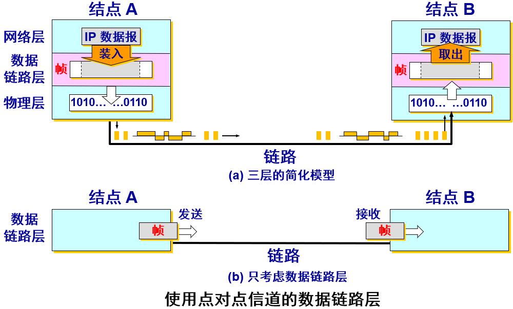
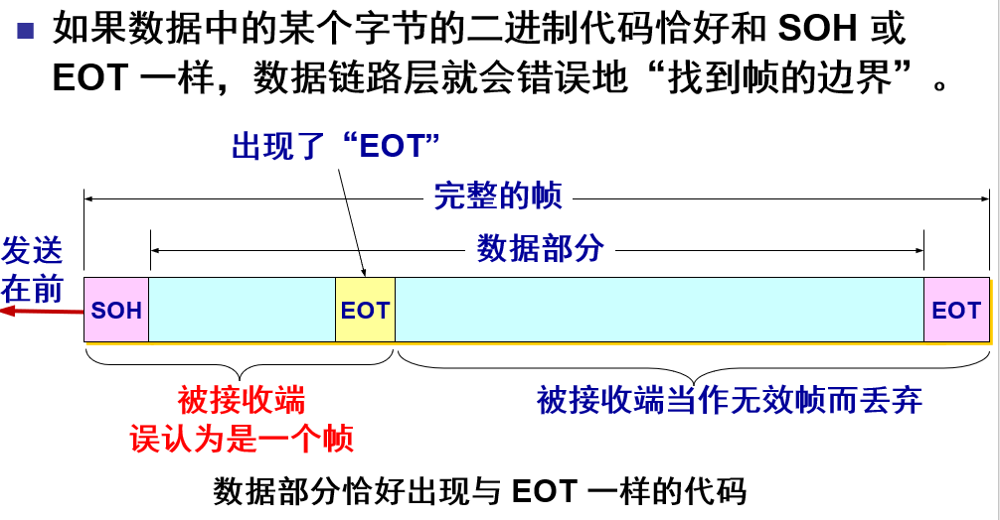
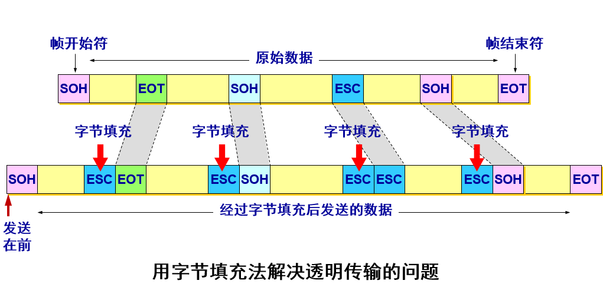
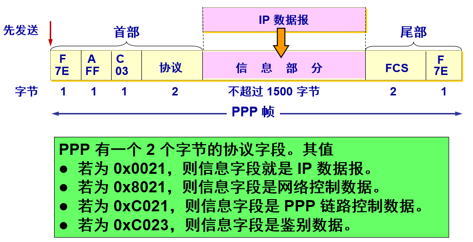
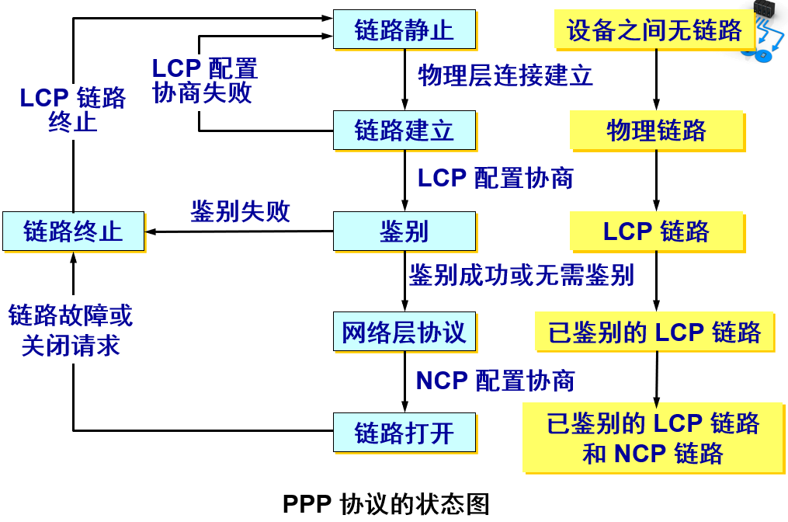
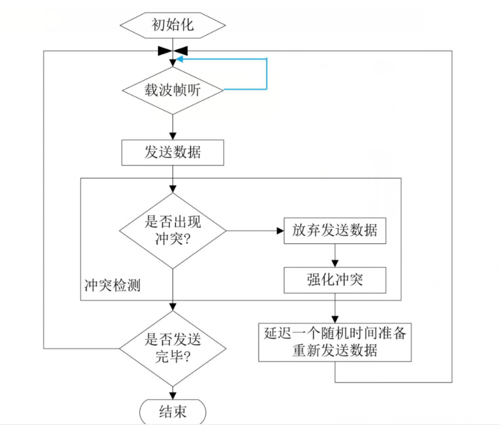
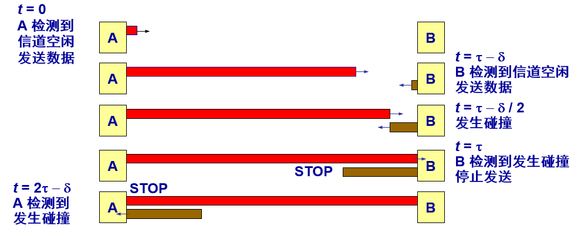
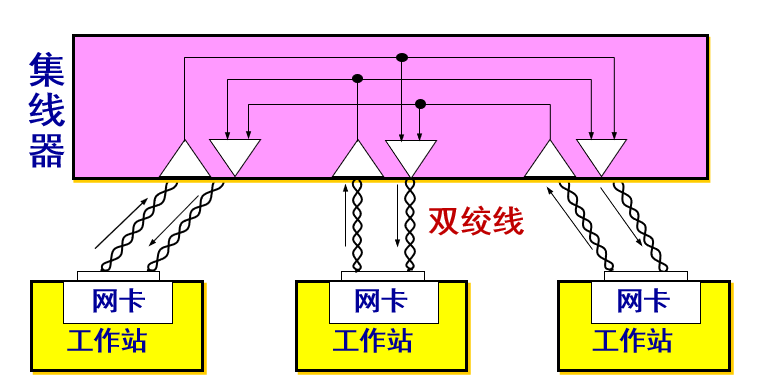
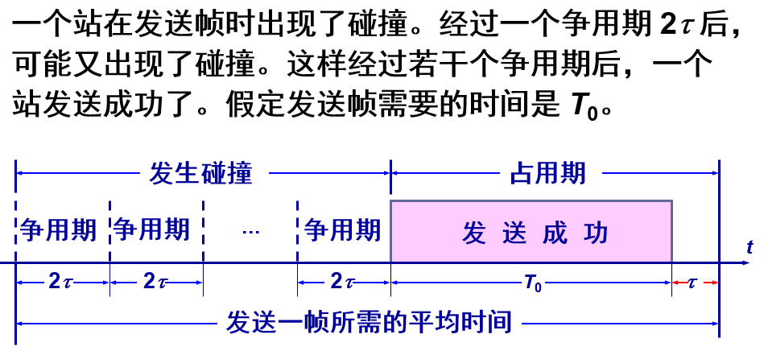

# 第三章-数据链路层

数据链路层属于计算机网络的低层，其使用的信道主要有两种：
+ **点对点信道**：一对一的点对点通信
+ **广播信道**：一对多的广播通信
局域网属于数据链路层
***
## 1.使用点对点信道的数据链路层
#### 数据链路和帧
***链路和数据链路不是一个概念***
**链路**：是一条无源的点到点的物理线路段（有线或无线），中间没有任何其他的交换结点。
一条链路只是一条通路的一个组成部分。
**数据链路**：除了物理线路外，还必须有**通信协议**来控制这些数据的传输。若把实现这些协议的硬件和软件加到链路上，就构成了数据链路。
现在最常用的方法是使用**网络适配器（即网卡）** 来实现这些协议的硬件和软件。
一般的适配器都包括了数据链路层和物理层这两层的功能。   
早期的数据通信协议曾叫做**通信规程**，因此在数据链路层规程和协议是同义词
数据链路层传送的是帧：

数据链路层不必考虑**物理层**如何实现比特传输的细节。甚至还可以更简单地设想好像是沿着两个数据链路层之间的水平方向把帧直接发送到对方。
#### 三个基本问题
**封装成帧、透明传输、差错检测**

**最大传送单元MTU**:帧的数据部分长度的上限

**透明传输**：

解决方法：**字节填充或字符填充**
发送端的数据链路层在数据中出现控制字符“SOH”或“EOT”的前面**插入一个转义字符“ESC”** (其十六进制编码是 1B)。
接收端的数据链路层在将数据送往网络层之前删除插入的转义字符。
如果转义字符也出现在数据当中，那么应在转义字符前面插入一个转义字符 ESC。当接收端收到连续的两个转义字符时，就删除其中前面的一个。

**差错检测**：
在传输过程中可能会产生比特差错：1 可能会变成 0 而 0 也可能变成 1。
在一段时间内，传输错误的比特占所传输比特总数的比率称为**误码率 BER**。
误码率与信噪比有很大的关系。
为了保证数据传输的可靠性，在计算机网络传输数据时，必须采用各种差错检测措施。 
在数据链路层传送的帧中，广泛使用了**循环冗余检验 CRC** 的检错技术。
在发送端，先把数据划分为组。假定每组 k 个比特。 假设待传送的一组数据 M = 101001（现在 k = 6）。我们在 M 的后面再添加供差错检测用的 n 位**冗余码**一起发送。  
>冗余码的计算：
用二进制的模 2 运算进行 2n 乘 M 的运算，这相当于在 M 后面添加 n 个 0。
得到的 (k + n) 位的数除以事先选定好的长度为 (n + 1) 位的**除数** P，得出**商**是 Q 而**余数**是 R，余数 R 比除数 P 少 1 位，即 R 是 n 位。 
将余数 R 作为冗余码拼接在数据 M 后面发送出去。

**帧检验序列FCS：**
在数据后面添加上的冗余码
循环冗余检验 CRC 和帧检验序列 FCS 并不等同。
+ CRC 是一种常用的检错方法，而 FCS 是添加在数据后面的冗余码。
+ FCS 可以用 CRC 这种方法得出，但 CRC 并非用来获得 FCS 的唯一方法。  

接收端对收到的每一帧进行CRC检验
(1) 若得出的余数 R = 0，则判定这个帧没有差错，就**接受**。
(2) 若余数 R ≠ 0，则判定这个帧有差错，就**丢弃**。
但这种检测方法并**不能确定究竟是哪一个或哪几个比特出现了差错**。
只要经过严格的挑选，并使用位数足够多的除数 P，那么出现检测不到的差错的概率就很小很小。 

**注意：**
仅用循环冗余检验 CRC 差错检测技术只能做到**无差错接受**。
“无差错接受”是指：“凡是接受的帧（即不包括丢弃的帧），我们都能以非常接近于 1 的概率认为这些帧在传输过程中没有产生差错”。也就是说：“凡是接收端数据链路层接受的帧都没有传输差错”（有差错的帧就丢弃而不接受）。
**要做到“可靠传输”（即发送什么就收到什么）就必须再加上确认和重传机制**。
“无比特差错”与“无传输差错”是不同的概念。
**在数据链路层使用 CRC 检验，能够实现无比特差错的传输，但这不是可靠传输**。

***
## 2.点对点协议PPP
PPP协议就是用户计算机和ISP进行通信时所使用的数据链路层协议。
#### PPP协议的特点
**应满足的需求：**
**简单** —— 这是首要的要求。
**封装成帧** —— 必须规定特殊的字符作为帧定界符。
**透明性** —— 必须保证数据传输的透明性。
**多种网络层协议** —— 能够在同一条物理链路上同时支持多种网络层协议。
**多种类型链路** —— 能够在多种类型的链路上运行。
**差错检测** —— 能够对接收端收到的帧进行检测，并立即丢弃有差错的帧。
**检测连接状态** —— 能够及时自动检测出链路是否处于正常工作状态。
**最大传送单元** —— 必须对每一种类型的点对点链路设置最大传送单元  MTU 的标准默认值(1500字节)，促进各种实现之间的互操作性。MTU是数据链路层的帧可以载荷的**数据部分**的最大长度，**不是帧的总长度**
**网络层地址协商** —— 必须提供一种机制使通信的两个网络层实体能够通过协商知道或能够配置彼此的网络层地址。
**数据压缩协商** —— 必须提供一种方法来协商使用数据压缩算法。
>PPP协议不需要的功能：
纠错 
流量控制 
设置序号 
多点线路 
半双工或单工链路 

PPP 协议有三个组成部分：
(1) 一个将 IP 数据报封装到串行链路的方法。
(2) 链路控制协议 LCP (Link Control Protocol)。
(3) 网络控制协议 NCP (Network Control Protocol)。

#### PPP协议的帧格式
1.各字段的意义
PPP 帧的首部和尾部分别为 4 个字段和 2 个字段。
1.标志字段 F = 0x7E （十六进制的 7E 的二进制表示是 01111110）。表示一个帧的开始或结束。如果连续出现两个标志字段，表示这是一个空帧
2.地址字段 A 只置为 0xFF。地址字段实际上并不起作用。
3.控制字段 C 通常置为 0x03。
PPP 是面向字节的，所有的 PPP 帧的长度都是整数字节。

透明传输问题：
当 PPP 用在同步传输（一连串的比特连续传送）链路时，协议规定采用硬件来完成比特填充（和 HDLC 的做法一样）。 
当 PPP 用在异步传输（逐个字符地传送）时，就使用一种特殊的字符填充法。 

2.字节填充
将信息字段中出现的每一个 0x7E 字节转变成为 2 字节序列 (0x7D, 0x5E)。 
若信息字段中出现一个 0x7D 的字节, 则将其转变成为 2 字节序列 (0x7D, 0x5D)。
若信息字段中出现 ASCII 码的控制字符（即数值小于 0x20 的字符），则在该字符前面要加入一个 0x7D 字节，同时将该字符的编码加以改变。

3.零比特传输
PPP 协议用在 SONET/SDH 链路时，使用同步传输。这时 PPP 协议采用零比特填充方法来实现透明传输。
在发送端，**只要发现有 5 个连续 1，则立即填入一个 0**。接收端对帧中的比特流进行扫描。每当发现 5 个连续1时，就把这 5 个连续 1 后的一个 0 删除。

#### PPP协议的工作状态
当用户拨号接入 ISP 时，路由器的调制解调器对拨号做出确认，并建立一条物理连接。
PC 机向路由器发送一系列的 LCP 分组（封装成多个 PPP 帧）。
这些分组及其响应选择一些 PPP 参数，并进行网络层配置，NCP 给新接入的 PC 机分配一个临时的 IP 地址，使 PC 机成为因特网上的一个主机。
通信完毕时，NCP 释放网络层连接，收回原来分配出去的 IP 地址。接着，LCP 释放数据链路层连接。最后释放的是物理层的连接。
可见，***PPP 协议已不是纯粹的数据链路层的协议，它还包含了物理层和网络层的内容。***

LCP的配置请求帧:（一个PPP帧）
+ 配置确认帧，所有选项都接受
+ 配置否认帧，所有选项都理解但不能接受
+ 配置拒绝帧，选项有的无法识别或不能接受，需要协商

***
## 3.使用广播信道的数据链路层
#### 局域网的数据链路层
局域网最主要的特点：**网络为一个单位所拥有，且地理范围和站点数目均有限**
>局域网具有如下主要优点：
具有广播功能，从一个站点可很方便地访问全网。局域网上的主机可共享连接在局域网上的各种硬件和软件资源。 
便于系统的扩展和逐渐地演变，各设备的位置可灵活调整和改变。
提高了系统的可靠性、可用性和残存性。

**注意，局域网工作的层次跨越数据链路层和物理层**
决定局域网特征的主要技术：
* 拓扑结构
* 传输介质
* 介质访问控制方法

共享信道技术：
+ 静态划分信道
>代价高，不适合局域网

+ 动态媒体接入控制（又称多点接入）
>**随机接入**，可能会产生碰撞（冲突），因此必须有解决冲突的协议
**受控接入**，不能随机发送信息，必须服从一定的控制

**以太网的两个标准**
DIX Ethernet V2 是世界上第一个局域网产品（以太网）的规约。
IEEE 802.3 是第一个 IEEE 的以太网标准。
DIX Ethernet V2 标准与 IEEE 的 802.3 标准只有很小的差别，因此可以将 802.3 局域网简称为“以太网”。
严格说来，“以太网”应当是指符合 DIX Ethernet V2 标准的局域网 。 
**将局域网的数据链路层拆成两个子层：**
逻辑链路控制 LLC (Logical Link Control)子层；
媒体接入控制 MAC (Medium Access Control)子层。
与接入到传输媒体有关的内容都放在 MAC子层，而 LLC 子层则与传输媒体无关。
不管采用何种协议的局域网，对 LLC 子层来说都是透明的。

**适配器的作用**
网络接口板又称为通信适配器 (adapter) 或网络接口卡 NIC (Network Interface Card)，或“网卡”。 
适配器的重要功能：
* 进行串行/并行转换。
* 对数据进行缓存。
* 在计算机的操作系统安装设备驱动程序。
* 实现以太网协议。  

#### CSMA/CD协议
**带有冲突检测的载波侦听多路访问协议**，是一种**随机争用型的介质访问控制方法**
>多点接入
载波监听
碰撞检测（边发送边监听）

**电磁波在1km电缆的传播时延约为5us**
碰撞检测，实际是用电子技术检测信道上的电压是否超过某一幅度值。干扰信号在信道上传输便会产生电压的变化，这样其他用户就知道此时信道繁忙，而不能发送自己的数据
检测到碰撞后：
在发生碰撞时，总线上传输的信号产生了严重的失真，无法从中恢复出有用的信息来。
每一个正在发送数据的站，一旦发现总线上出现了碰撞，就要立即停止发送，免得继续浪费网络资源，然后等待一段随机时间后再次发送。

为什么要进行碰撞检测
**由于电磁波在总线上的传播速率是有限的**，当某个站监听到总线是空闲时，也可能总线并非真正是空闲的。 
A 向 B 发出的信息，要经过一定的时间后才能传送到 B。B 若在 A 发送的信息到达 B 之前发送自己的帧 (因为这时 B 的载波监听检测不到 A 所发送的信息)，则必然要在某个时间和 A 发送的帧发生碰撞。
碰撞的结果是两个帧都变得无用。所以需要在发送期间进行碰撞检测，以检测冲突。  

**重要特性**
使用 CSMA/CD 协议的以太网不能进行全双工通信而只能进行双向交替通信（半双工通信）。
每个站在发送数据之后的一小段时间内，存在着遭遇碰撞的可能性。 
这种发送的不确定性使整个以太网的平均通信量远小于以太网的最高数据率。  
争用期
最先发送数据帧的站，在发送数据帧后**至多**经过时间 **2τ （两倍的端到端往返时延）**就可知道发送的数据帧是否遭受了碰撞。
以太网的端到端往返时延 2τ 称为**争用期**，或**碰撞窗口**。
**经过争用期这段时间还没有检测到碰撞，才能肯定这次发送不会发生碰撞。**

**二进制指数类型退避算法：**
发生碰撞的站在停止发送数据后，要推迟（退避）一个**随机时间**才能再发送数据。
**基本退避时间取为争用期 2τ**。
从整数集合 [0, 1, … , ($2^k$-1)] 中**随机**地取出一个数，记为 r。重传所需的时延就是 r 倍的基本退避时间。
参数 k 按下面的公式计算：
$$k = Min[重传次数, 10]$$
当 k ≤ 10 时，参数 k 等于重传次数。
当重传达 16 次仍不能成功时即丢弃该帧，并向高层报告。 

**争用期的长度**
10 Mbit/s 以太网取 51.2 微秒 为争用期的长度。
对于 10 Mbit/s 以太网，在争用期内可发送 512 bit，即 64 字节。
>这意味着：
以太网在发送数据时，若前 64 字节没有发生冲突，则后续的数据就不会发生冲突。
如果发生冲突，就一定是在发送的前 64 字节之内。 
由于一检测到冲突就立即中止发送，这时已经发送出去的数据一定小于 64 字节。 
以太网规定了最短有效帧长为 64 字节，凡长度小于 64 字节的帧都是由于冲突而异常中止的**无效帧**。

当发送数据的站一旦发现发生了碰撞时：
(1) 立即停止发送数据；
(2) 再继续发送若干比特的人为干扰信号，以便让所有用户都知道现在已经发生了碰撞。  (帧间最小间隔为9.6us)

#### 使用集线器的星形拓扑
传统以太网现在使用双绞线（便宜、灵活）
采用双绞线的以太网采用星形拓扑，在星形的中心则增加了一种可靠性非常高的设备，即**集线器**

**集线器的一些特点：**
(1) 集线器是使用电子器件来模拟实际电缆线的工作，因此整个系统仍然像一个传统的以太网那样运行。 
(2) **使用集线器的以太网在逻辑上仍是一个总线网，各工作站使用的还是 CSMA/CD 协议，并共享逻辑上的总线**。 
(3) 集线器很像一个多接口的转发器，工作在**物理层**。
(4) 集线器采用了专门的芯片，进行自适应串音回波抵消，减少了近端串音。

#### 以太网的信道利用率
多个站在以太网上同时工作就可能会发生碰撞。
当发生碰撞时，信道资源实际上是被浪费了。因此，当扣除碰撞所造成的信道损失后，**以太网总的信道利用率并不能达到 100%**。
假设 τ 是以太网单程端到端传播时延。则争用期长度为 2τ，即端到端传播时延的两倍。检测到碰撞后不发送干扰信号。
设帧长为 L (bit)，数据发送速率为 C (bit/s)，则帧的发送时间为  $T_0 = \frac{L}{C}(s)$ 。 

注意到，成功发送一个帧需要占用信道的时间是 $T_0 + τ$，比这个帧的发送时间要多一个单程端到端时延 τ。
这是因为当一个站发送完最后一个比特时，这个比特还要在以太网上传播。
在最极端的情况下，发送站在传输媒体的一端，而比特在媒体上传输到另一端所需的时间是 τ 。

为提高利用率，以太网的参数a的值应当尽可能小些。
对以太网参数 α 的要求是：
>当数据率一定时，以太网的连线的长度受到限制，否则 τ 的数值会太大。
以太网的帧长不能太短，否则 $T_0$ 的值会太小，使 α 值太大。 

#### 以太网的MAC层
在局域网中，**硬件地址**又称为**物理地址，或 MAC 地址**。 
802 标准所说的“地址”严格地讲应当是每一个站的“名字”或标识符。 
>如果连接在局域网上的主机或路由器安装有多个适配器，那么这样的主机或路由器就有多个“地址”。更准确些说，这种 48 位“地址”应当是某个接口的标识符。

IEEE 802 标准规定 MAC 地址字段可采用 6 字节 ( 48位) 或 2 字节 ( 16 位) 这两种中的一种。
IEEE 的注册管理机构 RA 负责向厂家分配地址字段 6 个字节中的前三个字节 (即**高位 24 位**)，称为**组织唯一标识符**。
地址字段 6 个字节中的后三个字节 (即**低位 24 位**) 由厂家自行指派，称为**扩展唯一标识符**，**必须保证生产出的适配器没有重复地址**。

一个地址块可以生成 224 个不同的地址。这种 48 位地址称为 MAC-48，它的通用名称是 EUI-48。
生产适配器时，6 字节的 MAC 地址已被固化在适配器的 ROM，因此，MAC 地址也叫做**硬件地址或物理地址**。
“MAC地址”实际上就是适配器地址或适配器标识符 EUI-48。

IEEE 规定地址字段的第一字节的最低位为 I/G 位。I/G 表示 Individual / Group。
>当 I/G位 = 0 时，地址字段表示一个**单站地址**。
当 I/G位 = 1 时，表示**组地址**，用来进行多播（以前曾译为组播）。此时，IEEE 只分配地址字段前三个字节中的 23 位。
当 I/G 位分别为 0 和 1 时，一个地址块可分别生成 223 个单个站地址和 223 个组地址。
所有 48 位都为 1 时，为广播地址。只能作为目的地址使用。

IEEE 把地址字段第一字节的最低第 2 位规定为 G/L 位，表示 Global / Local。
>当 G/L位 = 0 时，是**全球管理**（保证在全球没有相同的地址），厂商向IEEE购买的 OUI 都属于全球管理。
当 G/L位 = 1 时， 是**本地管理**，这时用户可任意分配网络上的地址。

**适配器检查MAC地址**
适配器从网络上每收到一个 MAC 帧就首先用硬件检查 MAC 帧中的 MAC 地址。
>如果是**发往本站的帧**则收下，然后再进行其他的处理。
否则就将此帧丢弃，不再进行其他的处理。
“发往本站的帧”包括以下三种帧： 
单播 (unicast) 帧（一对一）
广播 (broadcast) 帧（一对全体）
多播 (multicast) 帧（一对多）

所有的适配器都至少能够识别前两种帧，即**能够识别单播地址和广播地址**。
有的适配器可用编程方法识别多播地址。
**只有目的地址才能使用广播地址和多播地址**。
以**混杂方式**工作的以太网适配器只要“听到”有帧在以太网上传输就都接收下来。

**MAC帧的格式：**
两种标准：DIX　Ethernet　Ｖ２标准
ＩＥＥＥＥ的８０３.２标准
最常用的ＭＡＣ帧是**以太网V2的格式**

从MAC子层向下传到物理层时还要在帧的前面插入8个字节（由硬件生成），它由两个字段构成。第一个字段是7个字节的**前同步码(1和0交替码)**，它的作用是使接收端的适配器在接收MAC帧时能够迅速调整其时钟频率，使它和发送端的时钟同步，
也就是“实现位同步”(位同步就是比特同步的意思)。第二个字段是帧开始定界符，定义为 10101011。它的前六位的作用和前同步码一样，最后的两个连续的1就是告诉接收端适配器:“MAC帧的信息马上就要来了，请适配器注意接收”。
**MAC帧的FCS字段的检验范围不包括前同步码和帧开始定界符**。顺便指出，在使用SONET/SDH进行同步传输时则不需要用前同步码，因为在同步传输时收发双方的位同步总是一直保持着的。
还需注意，在以太网上传送数据时是以帧为单位传送的。以太网在传送帧时，各帧之间还必须有一定的间隙。因此，接收端只要找到帧开始定界符，其后面的连续到达的比特流就都属于同一个MAC帧。可见**以太网不需要使用帧结束定界符，也不需要使用字节插入来保证透明传输。**

类型字段是用来标志上一层使用的是什么协议，以便把收到的 MAC 帧的数据上交给上一层的这个协议。
当数据字段的长度小于 46 字节时，应在数据字段的后面加入整数字节的填充字段，以保证以太网的 MAC 帧长不小于 64 字节。 

**无效的MAC帧**
>数据字段的长度与长度字段的值不一致;
帧的长度不是整数个字节;
用收到的帧检验序列 FCS 查出有差错；
数据字段的长度不在 46 ~ 1500 字节之间;
有效的 MAC 帧长度为 64 ~ 1518 字节之间。

对于检查出的无效 MAC 帧就简单地丢弃。以太网不负责重传丢弃的帧。

**IEEE 802.3 MAC帧格式**
与以太网V2 MAC 帧格式相似，区别在于：
(1) IEEE 802.3 规定的 MAC 帧的第三个字段是“长度/类型”。
当这个字段值大于 0x0600 时（相当于十进制的 1536），就表示“类型”。这样的帧和以太网 V2 MAC 帧完全一样。
当这个字段值小于 0x0600 时才表示“长度”。
(2) 当“长度/类型”字段值小于 0x0600 时，数据字段必须装入上面的逻辑链路控制 LLC 子层的 LLC 帧。

***
## 4.拓展的以太网
1.在物理层扩展—集线器
>现在，双绞线以太网成为以太网的主流类型，扩展主机和集线器之间的距离的一种简单方法就是使用光纤(通常是一对光纤)和一对光纤调制解调器。
网络最大吞吐量仍是原来的一个的吞吐量大小，如果一个以太网使用10Mbit/s的适配器，另外的使用比它大的，他们都只能在10Mbit/s上工作。

2.在数据链路层扩展—网桥（自学习算法）（交换式集线器，又称为以太网交换机、第二层交换机）
>以太网交换机实质上就是多接口的网桥
网桥工作在数据链路层，它根据MAC帧的目的地址对收到的帧进行转发或过滤。当网桥收到一个帧时，并不是向所有的接口转发这个帧，而是检查此帧的目的MAC地址，然后再确定将该帧转发到哪一个接口，或者是把它丢弃(即过滤)。
使用以太网交换机时，虽然在每个接口到主机的带宽还是 10 Mbit/s，但由于一个用户在通信时是独占而不是和其他网络用户共享传输媒体的带宽，因此对于拥有 N 个接口的交换机的总容量为 N*10 Mbit/s。
